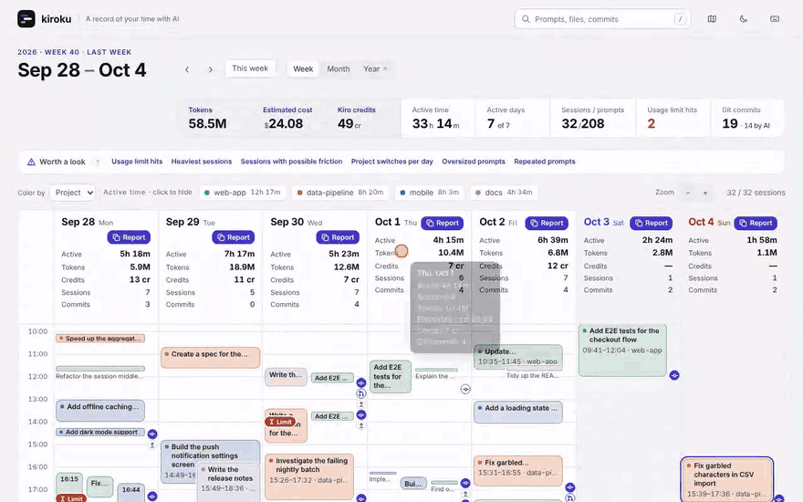

# kiroku

[](https://github.com/MichinaoShimizu/kiroku/actions/workflows/ci.yml) [](https://github.com/MichinaoShimizu/kiroku/releases) [](LICENSE) [](https://github.com/MichinaoShimizu/kiroku/actions/workflows/codeql.yml) [](https://scorecard.dev/viewer/?uri=github.com/MichinaoShimizu/kiroku) [](go.mod) [](https://github.com/MichinaoShimizu/kiroku/releases)

English | [日本語](README.ja.md)

**Your AI work history, visualized.** No AI. No external APIs. No uploads.

kiroku reads the local history of Claude Code, Kiro (IDE, CLI and Kiro Crew), Amazon Q Developer CLI and Codex CLI, and shows it on one calendar, only to you.

**[Try the live demo →](https://michinaoshimizu.github.io/kiroku/)** (dummy data, runs in your browser)

[](https://michinaoshimizu.github.io/kiroku/)

## Why kiroku

- **Every agent on one calendar.** Claude Code, Codex, Kiro and Amazon Q side by side, instead of one dashboard per agent.
- **Sessions you can read, not just count.** What you asked, what the AI replied, and the commands, commits and pull requests in between, next to time, tokens and cost.
- **Reviews written by your own agent.** kiroku never calls an AI. One click copies a prompt grounded in your history for the agent you already use.
- **Your history never leaves your computer.** A single binary, no account, no telemetry.

## Install

```bash
curl -fsSL https://raw.githubusercontent.com/MichinaoShimizu/kiroku/main/install.sh | sh   # macOS and Linux
kiroku doctor   # what kiroku found, and whether any history is about to be deleted
kiroku serve    # open the view at http://localhost:8484/
```

The installer checks the download against `checksums.txt` and, with the [GitHub CLI](https://cli.github.com/), its build provenance. On Windows, use the zip from [Releases](https://github.com/MichinaoShimizu/kiroku/releases); with Go, `go install github.com/MichinaoShimizu/kiroku@latest`. See the [guide](docs/guide.md#install) for more.

> [!IMPORTANT]
> **Claude Code deletes conversations older than 30 days by default**, and kiroku can only show what is still there. Set `"cleanupPeriodDays": 3650` in `~/.claude/settings.json` ([docs](https://code.claude.com/docs/en/settings-reference#cleanupperioddays)), or run `kiroku archive on` to let kiroku keep compressed copies ([details](docs/guide.md#keep-a-copy-of-history-in-kiroku)).

## What you get

**Every session on a calendar.** When, in which project and what you asked, by week or month, with each day's active time, tokens, cost and Git commits.


**The whole story of a session.** The prompt flow with times, separating what you typed from what entered on its own, with commands, commits, pull requests, subagents and interruptions in between, and the AI's reply after each prompt, so a session reads as the conversation it was. One click copies a review prompt for it (see below).


**Every number opens up.** Click any figure, at the top or in the weekly summary, such as tokens, estimated cost or Git commits, to see it by day, agent, project and model, with the sessions, commits or prompts behind it. The metrics guide (`G`) shows how the metrics fit together, and what they can't tell you.

**What's worth a look.** Metrics that crossed a threshold are listed under the key figures. Press one to see what was observed, why it matters, the sessions behind it, an 8-week trend and what to try, without leaving the calendar.


**Cost next to output.** Time, tokens, estimated cost (Claude Code, Codex and Kiro Crew's non-Kiro backends, at public API rates) and credits by project, next to commits and cost per commit. Not every agent records everything; the guide lists [what each agent records](docs/guide.md#what-each-agent-records).


**Search across all time.** Prompts, edited files and commits, with excerpts showing where they matched.

**Your year in one picture.** "Year", next to Week and Month, draws a year of active time as streaks of light, and makes an image to share where you choose what goes on it: no prompts, project names or cost, and nothing about late nights or time off unless you tick it. It describes how you worked; it doesn't score or rank you.


## Reviews and advice, written by your own agent

kiroku never calls an AI. Instead, one click copies a prompt that you paste into the AI agent you already use on this computer, such as Claude Code or Codex. The prompt carries the facts kiroku counted and points the agent to the history files, so the agent reads what really happened and writes a review in a fixed format, ending with advice from an expert on working with AI agents.

| Scope | Where | What you get |
|---|---|---|
| A session | "Copy review prompt" in session details | Summary, numbers, each place that needed rework with the prompt behind it and its cause (something missing from your prompt, a hard task, or the AI's own mistake), advice, and an example first prompt for next time |
| A day | "Report" next to each date in the week calendar | A daily report: summary, numbers next to the previous day, what was done in each project and why, and advice |
| A week or month | "Copy weekly report prompt" ("monthly" in month view) in the summary | The same report for the week or month, numbers next to the previous period, ready to share with your team |

The advice is grounded in your history, not generic tips. Each point names what it is based on: a figure, a prompt with its time, or a signal kiroku counted. It covers

- **how you write prompts**: context, constraints and done criteria that were missing, and corrections a clearer first prompt would have avoided
- **how you use agents**: splitting and ordering work, checking results, long sessions, waiting
- **model and context**: whether the model fits the work (for example a one-line question on an Opus-class model), conversations that grew long, compactions, and switching between projects
- **what to move out of your prompts**: an instruction you keep typing into a skill or the project's agent instructions, a separate role into a subagent, fixed steps into a script

An excerpt from a weekly report written from dummy history:

> - **Turn the repeated check into a skill or script.** You typed "Run the full test suite and the linter, fix anything that fails, and show me the summary" 3 times in 3 sessions. Make it a skill or a project script the agent runs before each commit.
> - **Use a lighter model for quick questions.** On Thu, Aug 13 at 10:00 you asked a one-line question in a separate Opus session. A lighter model is enough for questions like this.

The prompts stay light: a report carries a short digest of each session, and the agent opens a history file only when the digest isn't enough. See the [guide](docs/guide.md#reviews-and-reports-with-your-agent) for what each prompt contains.

## Privacy

- Your history never leaves your computer: no telemetry, no account, no AI service. The only network access is checking for and downloading kiroku's own releases from GitHub.
- Files kiroku writes from your history are readable only by you, and `kiroku serve` listens on `127.0.0.1` and opens only for browsers that have its key.
- The HTML contains your prompts, the AI's replies, file paths and commit messages as they are. Check it before sharing.
- The review and report prompts point an AI agent on your computer to your history files, and the agent reads them. Use an agent you'd trust with them.

See [SECURITY.md](SECURITY.md) for details and for verifying a release.

## Usage

```bash
kiroku serve              # the view at http://localhost:8484/, updated as new history arrives
kiroku open               # open it in another browser (it needs serve's key once)
kiroku autostart on       # start kiroku serve each time you log in (macOS and Linux)
kiroku stats --week last  # last week on one terminal screen: time, tokens, cost and commits by agent, model and project
kiroku html --week last   # write only last week as one HTML file, to show someone
kiroku update             # update to the latest release
kiroku help               # all commands ("kiroku <command> --help" for options)
```

The [guide](docs/guide.md) explains the view, every metric, which histories are read, all options, and [how to uninstall](docs/guide.md#uninstall). [Compatibility](docs/compatibility.md) says what a version number promises.

## Contributing

If kiroku is useful to you, a ⭐ helps others find it. Issues and pull requests are welcome in English or Japanese. See [CONTRIBUTING.md](CONTRIBUTING.md), and report vulnerabilities privately as described in [SECURITY.md](SECURITY.md).

## License

[MIT](LICENSE)
