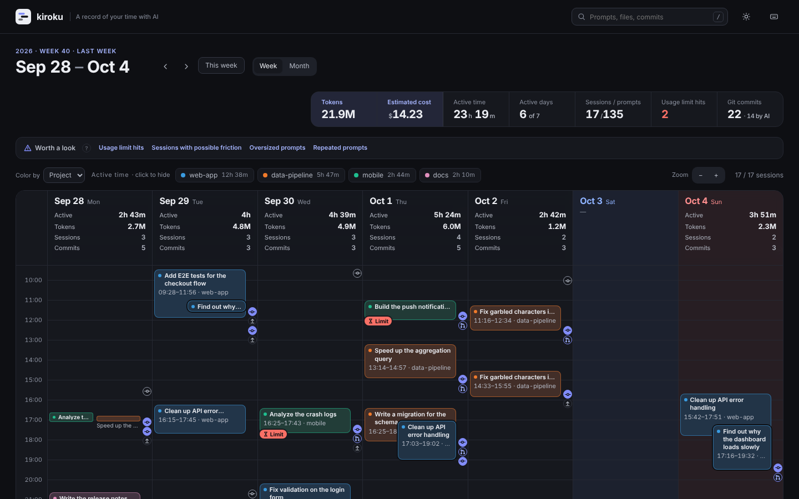

# kiroku

AI エージェント（Claude Code・Kiro・Kiro Crew・Amazon Q・Codex）の作業履歴を、Google カレンダーのような週表示で振り返るツールです。

- **一目でわかる**：いつ・どのプロジェクトで・何を頼んでいたかを、週カレンダーの帯で見られます
- **判断に使える**：週ごとに重点を 1 つ決め、ガードレールで行き過ぎに気づき、判断を Markdown に残せます
- **手元で完結**：各エージェントが自分の PC に残している履歴を読むだけです。どこにも送りません



## 入れ方

macOS・Windows・Linux で、実行ファイル 1 つで動きます。ほかに入れるものはありません。

- [Releases](https://github.com/MichinaoShimizu/kiroku/releases) に自分の OS 向けのファイルがあれば、落として展開する
- Go が入っていれば: `go install github.com/MichinaoShimizu/kiroku@latest`

## 使い方

```bash
kiroku              # これまでの履歴を kiroku.html に書き出して、ブラウザで開く
kiroku --serve      # 手元にサーバーを立てて開く。作業中に増えた履歴もその場で反映する
kiroku --weekly     # 最新の週のふりかえりを Markdown で書き出す
```

- **`kiroku`** は、起動した時点までの履歴をすべて読み、1 つの HTML に書き出します。そのあと増えた履歴は、もう一度実行すると入ります
- **`kiroku --serve`** は `http://localhost:8484/` で画面を出し続けます。数秒ごとに履歴フォルダの変化（ファイルの名前・大きさ・更新時刻だけ）を確かめ、変わっていたら読み直します。画面は見ている週や選んでいるセッションをそのままに新しい履歴を取り込み、左上に `LIVE` が出ます。判断ログ（`kiroku-week-*.md`）を書き足したときも反映されます。止めるときは Ctrl+C
- **`kiroku --weekly`** は、週のまとめと判断を書く欄を `kiroku-week-<月曜日>.md` に書き出します（下の「週のふりかえり」）

ほかのオプションは、下の「オプション」にまとめています。

## 画面でできること

- 週カレンダーにセッションを帯で表示（発言が多いほど濃く）
- 色分けはプロジェクト / ブランチ / ツール（エージェント）で切り替え。凡例クリックで表示・非表示
- 帯をクリックすると右に詳細：依頼の流れ（時刻つき）、使ったツール、変更したファイル、再開コマンド
- キーボード：`←` `→` で週移動、`T` で今週、`/` で検索、`+` `−` でズーム、`Esc` で週のまとめに戻る、`?` で一覧
- テーマは自動・ライト・ダークを切り替えられます（右上のボタン）。色分け・ズーム・テーマはブラウザに覚えておきます
- スマホ幅では 1 日ずつ表示します（上の曜日タブで切り替え）
- 色は色覚の違いがあっても隣同士を見分けられるように検証した 8 色（藍・朱・青竹・山吹・牡丹・萌黄・藤・紅）。9 番目以降は灰色になります

## 週のふりかえり

週のパネルは、数字を眺めるためではなく、次の一手を決めるために組んでいます。上から順に読むと判断までたどり着きます。

1. **今週の重点**：その週に強めたいことを自分で 1 つだけ選び、それに合う数字を大きく出します。kiroku からは選びません
2. **ガードレール**：目標ではなく閾値です。閾値は自分の直前 8 週までの値から決めます（上側の四分位 + 1.5 × 四分位範囲）。基準の週が 3 つ未満のあいだは「基準づくり中」です
3. **計測の状態**：読めた履歴の数、「不明」になった指標、料金表にないモデル、指標の定義の版
4. **先週の判断と一手**：先週の Markdown に書いた判断・理由・次の一手・確認日を読み返します
5. **今週の判断**：継続・変更・中止・保留・判断なしから 1 つ選び、理由とあわせて週の Markdown に書きます（下の「判断の残し方」）

| 重点（強めたいこと） | 見る数字 | めざす方向 |
|---|---|---|
| 任せられる依頼にする | 言い直し・中断のあった依頼の割合 | 下がる |
| まとまった時間を守る | 集中ブロック（60 分以上） | 上がる |
| 切り替えを減らす | 1 日のプロジェクト切り替え（平均） | 下がる |
| 費用に見合う使い方にする | 1 依頼あたりの目安コスト | 下がる |

ガードレールは、深夜の作業・週末の作業・言い直し・中断の率・1 依頼あたりの目安コストの 4 つです（重点に選んだものは外して、1 日の切り替えを入れます）。

### 判断の残し方

```bash
kiroku --weekly --journal ~/notes/kiroku   # 週のふりかえりを書き出す
```

書き出した Markdown の下のほう（`<!-- kiroku: この線より下は自分で書く欄です … -->` より下）に、重点・先週の一手・判断・理由・次の一手・次に確認する日を書きます。もう一度 `--weekly` を実行しても、この欄は消えません。次に `kiroku --journal ~/notes/kiroku` を実行すると、画面の「先週の判断と一手」に出ます。重点は、書いていない週には前の週のものを引き継ぎます。

### 数字の約束

- 率には分母（n）を添えます。データがないときは 0 ではなく「不明」と出します
- 指標の定義には版（今は v1）があります。版が違う週とは比べないでください
- 言い直し・中断の率は、依頼文の言葉（「違う」「やり直して」など）と中断から推定した**目安**です
- 待たせ時間は、短いほど良いとは限りません。良い・悪いの色はつけていません
- トークン・目安コスト・AI の延べ稼働・セッション数は「参照値」です。生産性や節約した時間ではありません

## 週のまとめ（参照値）


ふりかえりの下に、週のまとめが参照値として出ます（セッションを選んでいるときは「週のまとめ」ボタンで戻れます）。`--weekly` で同じ内容を Markdown にも書き出せます。メモ欄つきなので、そのまま週次のふりかえりや Claude への相談に使えます。

| 指標 | 意味 |
|---|---|
| 作業していた時間 | どれかのセッションが動いていた時間（重なりは 1 回分） |
| AI の延べ稼働 | 並列で動かした分も足した合計 |
| 集中ブロック | 5 分までの切れ目を許して 60 分以上続いた作業と、その中で一番多かったプロジェクト |
| 1 日の切り替え | 続けて出した依頼のプロジェクトが変わった回数 |
| 並列で動かした時間 | 2 本以上のセッションが同時に動いていた時間と、最大の本数 |
| 待たせ時間 | AI が返してから次の依頼を出すまで（30 分以内のもの）の中央値と 90% 点 |
| 深夜・週末 | 22〜6 時と土日に作業していた時間 |
| こじれたかもしれないセッション | 言い直し（「違う」「やり直して」など）、中断、依頼 15 回以上が多いもの |

### AI の使い方

| 指標 | 意味 |
|---|---|
| 目安コスト（API 換算） | 履歴のトークン数に API の公開料金をかけた換算。サブスクリプションの請求額とは別物 |
| トークン | 入力・出力・キャッシュの読み書きの合計。1 つの応答が複数行に分かれて記録されるので、メッセージ ID ごとにまとめてから数えます |
| キャッシュから読んだ割合 | 入力のうちキャッシュから読んだ割合 |
| モデル別 | モデルごとの目安コストとトークン |
| サブエージェント | `Task` / `Agent` で呼んだ回数、種類、延べ時間。詳細パネルでは、いつ・どの種類に・何を頼んで・どれくらいかかったかを並べます |
| Kiro クレジット | Kiro の履歴に残っている実際のクレジット |
| 重かったセッション | 目安コストの大きい順に 3 つ |

料金表は 2026 年 10 月時点の [公開料金](https://platform.claude.com/docs/en/about-claude/pricing) を入れています。変わったときや、知らないモデルを足したいときは JSON で上書きできます（モデル ID の先頭一致、USD / 100 万トークン）。

```json
{"claude-opus-5-5": {"input": 4, "output": 20, "cache_write": 5, "cache_write_1h": 8, "cache_read": 0.2}}
```

```bash
kiroku --prices my-prices.json
```

### エージェント別の参考指標

それぞれのエージェントが履歴に残している数字を、エージェントごとに並べます（週のまとめ・週の Markdown・セッションの詳細）。定義がエージェントごとに違うので、**エージェント同士では比べないでください**。どれも参照値で、目標ではありません。記録がない数字は 0 ではなく、出しません。

| エージェント | 参考指標 |
|---|---|
| Claude Code | 応答の数、1 応答あたりの出力トークン、入力のうちキャッシュから読んだ割合、ツール呼び出し、サブエージェントの実行 |
| Kiro CLI | クレジット、ターン、1 ターンあたりのクレジット、モデルへのリクエスト、組み込みツールの実行 |
| Kiro IDE | クレジット、ターン、1 ターンあたりのクレジット、ツール呼び出し |
| Kiro Crew | Crew から動かした会話、うちサブエージェント、クレジット、ターン |
| Kiro CLI（SQLite）・Amazon Q | 最初の返事までの時間（中央値）、応答にかかった時間（中央値）、応答の長さ（平均）、ツール呼び出し |
| Codex | 応答の数、推論トークン、出力のうち推論の割合、入力のうちキャッシュから読んだ割合、コンテキストの最大使用率、レート制限の最大使用率、ツール呼び出し |

時刻はこのマシンのタイムゾーンで数えます。どれも履歴から推定した目安です。

> 自分のふりかえり用の数字です。人と比べたり、評価に使ったりするためのものではありません。

## 読む履歴

| ツール | 場所 | 時刻の細かさ |
|---|---|---|
| Claude Code | `~/.claude/projects/*/*.jsonl` | 発言ごと |
| Kiro IDE（v1.0 以降） | `~/.kiro/sessions/<hash>/sess_*/` | 発言ごと |
| Kiro CLI | `~/.kiro/sessions/cli/` | 依頼ごと |
| Kiro IDE（v1.0 より前） | `<globalStorage>/kiro.kiroagent/workspace-sessions/` | 開始と最終更新だけ |
| Kiro CLI（古い版） | `kiro-cli/data.sqlite3`（下の表） | 依頼ごと |
| Amazon Q Developer CLI | `amazon-q/data.sqlite3`（下の表） | 依頼ごと |
| Codex CLI | `~/.codex/sessions/YYYY/MM/DD/rollout-*.jsonl`（`.jsonl.zst` も）と `archived_sessions/` | 発言ごと |

`data.sqlite3` の場所:

| OS | 場所 |
|---|---|
| macOS | `~/Library/Application Support/<kiro-cli か amazon-q>/` |
| Linux | `$XDG_DATA_HOME`（なければ `~/.local/share`）`/<kiro-cli か amazon-q>/` |
| Windows | `%LOCALAPPDATA%\<kiro-cli か amazon-q>\`（Kiro CLI は未確認。違っていたら `--kiro-cli-db` で指定してください） |

- `KIRO_HOME` が設定されていればそちらを見ます
- Kiro CLI は新しい形式（`~/.kiro/sessions/cli`）と SQLite に同じ会話が残ることがあります。同じ会話 ID のものは新しい形式のほうだけを数えます（クレジットが入っているため）。外した数は「計測の状態」に出ます
- SQLite のほうにはトークンやクレジットが残っていないので、目安コストやクレジットには入りません
- **Kiro Crew** は kiro-cli を動かすので、会話そのものは Kiro CLI の履歴（`~/.kiro/sessions/cli`）に残ります。kiroku はそちらを数え、Crew の `session_map.json` と `subagents/*/state.json` に載っている会話には「Kiro Crew」の目印と、Crew のタイトル（サブエージェントならエージェント名と依頼内容）をつけます。Crew の使用量の記録（`usage/tokens`）は kiro-cli のクレジットと同じものなので、足しません
- **Codex** のトークンは、同じ値が何度も書き直されるので、同じものは 1 回だけ数えます。新しい版の `token_usage_record` があればそちらを使います。サブエージェントやフォークのファイルは親の履歴を先頭に写しているので、そのファイルが作られた時刻より前の行は数えません。サブエージェントは親のセッションの「サブエージェント」にまとめます。タイトルは `session_index.jsonl` から取ります
- Codex のモデル（OpenAI）は料金表に入れていないので、目安コストには入りません（「計測の状態」に、料金表にないトークンとして出ます）。入れたいときは `--prices` で足せます

Kiro の形式には公式ドキュメントがないため、[kiro-history](https://github.com/pajaydev/kiro-history) と [codeburn](https://github.com/getagentseal/codeburn) の実装を参考にしています。SQLite の形は [amazon-q-developer-cli](https://github.com/aws/amazon-q-developer-cli) のソースに合わせています（`conversations_v2` は Kiro CLI だけにあり、参考実装をもとにしています）。読めない履歴があれば issue で教えてください。

## オプション

| オプション | 既定 | 説明 |
|---|---|---|
| `--sources` | `claude,kiro,amazonq,codex` | 読む履歴（カンマ区切り。Kiro Crew は `kiro` に入ります） |
| `--root` | `~/.claude/projects` | Claude Code の履歴の場所（`CLAUDE_CONFIG_DIR` も見ます） |
| `--kiro-home` | `~/.kiro` | Kiro のデータの場所（`KIRO_HOME` も見ます） |
| `--crew-home` | `~/.kiro/crew` | Kiro Crew のデータの場所（`KIROCREW_HOME` も見ます） |
| `--kiro-cli-db` | OS ごと | Kiro CLI（古い版）の `data.sqlite3` |
| `--amazonq-db` | OS ごと | Amazon Q Developer CLI の `data.sqlite3` |
| `--codex-home` | `~/.codex` | Codex のデータの場所（`CODEX_HOME` も見ます） |
| `--gap` | `15` | 何分あいたら帯を分けるか |
| `-o`, `--out` | `kiroku.html` | 書き出す HTML |
| `--no-open` | | ブラウザを開かない |
| `--weekly [日付]` | | 週のふりかえりを `kiroku-week-<月曜日>.md` に書き出す |
| `--prices` | | 料金表を JSON で上書き（下の「AI の使い方」参照） |
| `--journal` | `.` | 週のふりかえり（判断ログ）を置くフォルダ。kiroku はここの `kiroku-week-*.md` を読み返します |
| `--json` | | 集計結果を JSON で書き出す（ほかのツールに渡したいとき） |
| `--serve [待ち受け先]` | `127.0.0.1:8484` | サーバーを立て、増えた履歴をその場で画面に反映する。`--serve :8485` のようにポートを変えられます |
| `--interval` | `5s` | `--serve` で履歴の変化を確かめる間隔 |
| `--version` | | 版を表示する |

## 開発

```bash
go test ./...      # testdata/ の合成データで、集計と Markdown が正解と一致するかを確かめる
go build .         # ./kiroku ができる
```

- エージェントを足すときは `internal/source` に `Source` を実装して、`source.All` に加えます。集計（`internal/report`）と画面（`internal/web/template.html`）は、共通のセッションの形（`internal/core`）だけを見ます
- `testdata/golden.json` と `testdata/golden-week.md` は、Go に移す前の Python 版が同じ合成データから出した結果です。Go 版はこれと同じ数字を出します
- `v*` のタグを打つと、GitHub Actions が GoReleaser で各 OS 向けのファイルを Releases に載せます

## 注意

- 書き出した HTML と週の Markdown には、依頼文やファイルパスがそのまま入ります。人に渡すときは中身を確かめてください（このリポジトリの `.gitignore` では `*.html` と `kiroku-week-*.md` を除外しています）
- 判断ログは `--journal ~/notes/kiroku` のように、自分用のフォルダに置くのがおすすめです
- `--serve` は既定で自分の PC からしか開けません（`127.0.0.1` で待ち受け、ほかのホスト名で来たリクエストは断ります）。`--serve 0.0.0.0:8484` のように外に開くと、同じネットワークの人も履歴を見られます
