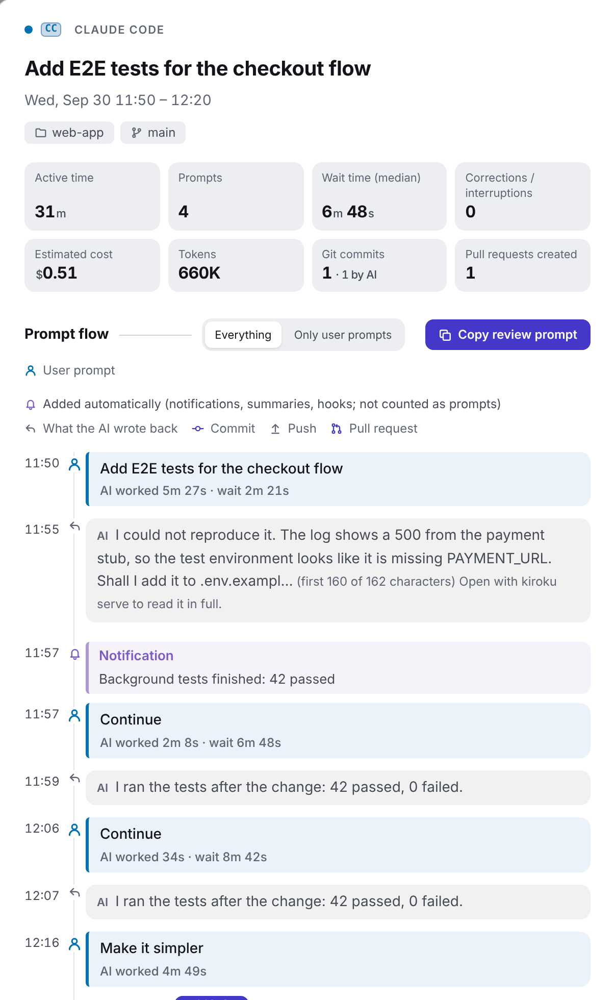
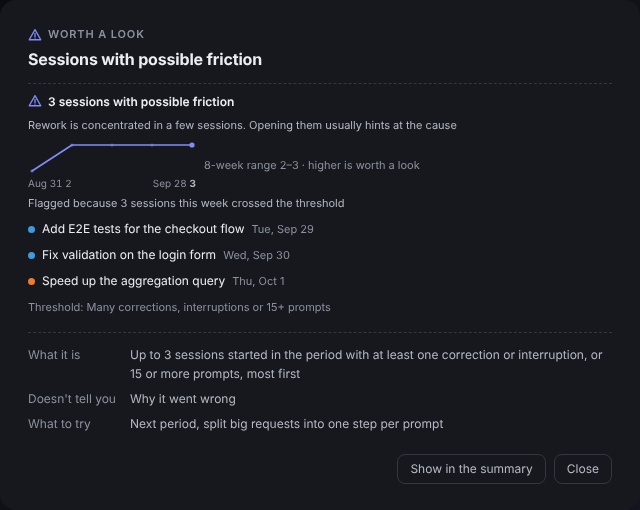
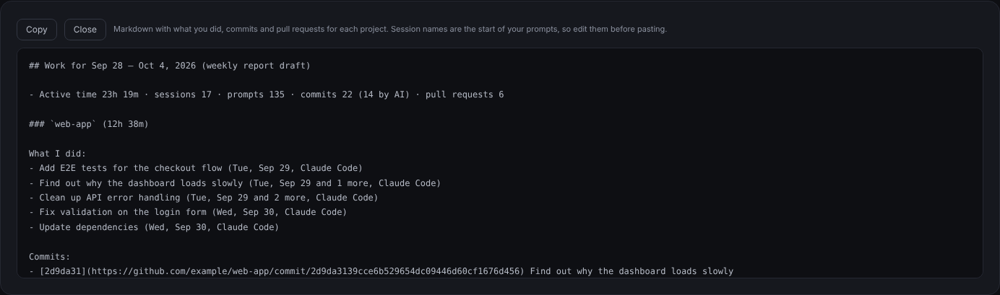

# kiroku

[](https://github.com/MichinaoShimizu/kiroku/actions/workflows/ci.yml) [](https://github.com/MichinaoShimizu/kiroku/releases) [](LICENSE) [](https://github.com/MichinaoShimizu/kiroku/actions/workflows/codeql.yml) [](https://scorecard.dev/viewer/?uri=github.com/MichinaoShimizu/kiroku) [](go.mod) [](https://github.com/MichinaoShimizu/kiroku/releases)

**Your AI work history, visualized.** No AI. No external APIs. No uploads.

kiroku reads the local history of Claude Code, Kiro (IDE, CLI and Kiro Crew), Amazon Q Developer CLI and Codex CLI, and shows it on one calendar, only to you.

**[Try the live demo →](https://michinaoshimizu.github.io/kiroku/)** (dummy data, runs in your browser)


## Install

```bash
curl -fsSL https://raw.githubusercontent.com/MichinaoShimizu/kiroku/main/install.sh | sh   # macOS and Linux
kiroku doctor   # what kiroku found, and whether any history is about to be deleted
kiroku serve    # open the view at http://localhost:8484/
```

The installer checks the download against `checksums.txt` and, with the [GitHub CLI](https://cli.github.com/), its build provenance. On Windows, use the zip from [Releases](https://github.com/MichinaoShimizu/kiroku/releases); with Go, `go install github.com/MichinaoShimizu/kiroku@latest`. See the [guide](docs/guide.md#install) for more.

> [!IMPORTANT]
> **Claude Code deletes conversations older than 30 days by default**, and kiroku can only show what is still there. Set `"cleanupPeriodDays": 3650` in `~/.claude/settings.json` ([docs](https://code.claude.com/docs/en/settings-reference#cleanupperioddays)), or run `kiroku archive on` to let kiroku keep compressed copies ([details](docs/guide.md#keep-a-copy-of-history-in-kiroku)).

## What you get

**Every session on a calendar.** When, in which project and what you asked, by week or month, with each day's active time, tokens, cost and Git commits.

**The whole story of a session.** The prompt flow with times, separating what you typed from what entered on its own, with commands, commits, pull requests, subagents and interruptions in between, and the AI's reply after each prompt, so a session reads as the conversation it was. Copy your prompts, or a prompt that asks an AI to review the session.



**What's worth a look.** Metrics that crossed a threshold are listed under the key figures. Press one to see what was observed, why it matters, the sessions behind it, an 8-week trend and what to try, without leaving the calendar.



**Cost next to output.** Time, tokens, estimated cost and credits by project, next to commits and cost per commit.


**A weekly report in one click.** A Markdown draft of what you did, your commits and pull requests, for each project. Search covers prompts, edited files and commits across all time.



## Privacy

- Your history never leaves your computer: no telemetry, no account, no AI service. The only network access is checking for and downloading kiroku's own releases from GitHub.
- Files kiroku writes from your history are readable only by you, and `kiroku serve` listens on `127.0.0.1` and opens only for browsers that have its key.
- The HTML contains your prompts, the AI's replies, file paths and commit messages as they are. Check it before sharing.

See [SECURITY.md](SECURITY.md) for details and for verifying a release.

## Usage

```bash
kiroku serve              # the view at http://localhost:8484/, updated as new history arrives
kiroku open               # open it in another browser (it needs serve's key once)
kiroku autostart on       # start kiroku serve each time you log in (macOS and Linux)
kiroku html --week last   # write only last week as one HTML file, to show someone
kiroku update             # update to the latest release
kiroku help               # all commands ("kiroku <command> --help" for options)
```

The [guide](docs/guide.md) explains the view, every metric, which histories are read, all options, and [how to uninstall](docs/guide.md#uninstall).

## Contributing

Issues and pull requests are welcome in English or Japanese. See [CONTRIBUTING.md](CONTRIBUTING.md), and report vulnerabilities privately as described in [SECURITY.md](SECURITY.md).

## License

[MIT](LICENSE)
