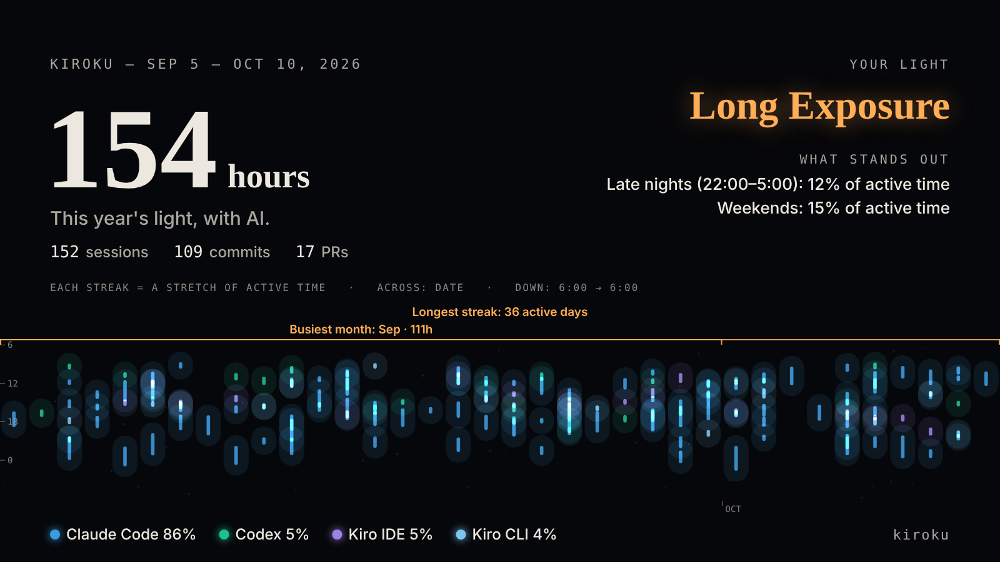

# kiroku guide

This guide supplements the [README](../README.md). It covers installation and commands in detail, how to read the view, metric definitions, which histories are read, and options.

## Install

### macOS and Linux (recommended)

```bash
curl -fsSL https://raw.githubusercontent.com/MichinaoShimizu/kiroku/main/install.sh | sh
```

This downloads the file for your OS and CPU (Intel / Apple Silicon and ARM) from [Releases](https://github.com/MichinaoShimizu/kiroku/releases), verifies it with `checksums.txt`, and places it in `/usr/local/bin` (or `~/.local/bin` if that is not writable). You can set the version and install location with environment variables.

```bash
curl -fsSL https://raw.githubusercontent.com/MichinaoShimizu/kiroku/main/install.sh | KIROKU_VERSION=v0.1.7 KIROKU_INSTALL_DIR=~/bin sh
```

### Windows

Download `kiroku_<version>_windows_<amd64 or arm64>.zip` from [Releases](https://github.com/MichinaoShimizu/kiroku/releases) and extract it.

### Go

```bash
go install github.com/MichinaoShimizu/kiroku@latest
```

> On macOS, opening a `kiroku` downloaded with a browser may show "“kiroku” Not Opened" (because it is not notarized by Apple). `install.sh` and `go install` do not trigger this warning. If you downloaded it with a browser, run `xattr -d com.apple.quarantine ./kiroku`, or open it with "Open Anyway" in System Settings → Privacy & Security.

## Commands

| Command | Description |
|---|---|
| `kiroku serve [ADDR]` | Serves the view at `http://localhost:8484/` and keeps it up to date. Every few seconds it checks the history folders for changes (file names, sizes and modification times only) and reloads once writing settles (when changes stop for 10 seconds; even if an agent keeps writing, it reloads within 60 seconds at most). New history appears while the week or month you are viewing and the selected session stay as they are, and `LIVE` is shown at the top left. Change the port with, for example, `kiroku serve :8485` (a bare port still listens on `127.0.0.1` only). Press Ctrl+C to quit |
| `kiroku html [-o FILE]` | Reads all history up to now and writes it to a single HTML file, then opens it in your browser (`--no-open` to skip). Use it to carry the view around or to look at it without starting a server. Run it again to include later history. `--week` or `--month` writes only one period (see "[Share one week or month](#share-one-week-or-month)") |
| `kiroku json [-o FILE]` | Writes the aggregated data as JSON (`-o -` for stdout) |
| `kiroku doctor` | Checks your setup in one go and only reads: which histories were found (sessions and the oldest date for each agent, and where it looked), whether an agent will delete old history (Claude Code on its 30-day default) and which settings file to change, whether `kiroku archive` is on and whether git is found. It ends with what to run next. Run it right after installing, or when something you expect is missing from the view |
| `kiroku archive [on\|off]` | Keeps compressed copies of history that agents delete automatically (Claude Code, Kiro Crew) in kiroku's own folder (see "[Keep a copy of history in kiroku](#keep-a-copy-of-history-in-kiroku)"). With no argument, shows the status (on or off, location, number and size of files) |
| `kiroku version` | Prints the version |
| `kiroku update` | Downloads the latest release for the same OS and CPU from GitHub Releases, verifies it with `checksums.txt`, and replaces itself. In a location you cannot write to (such as `/usr/local/bin`), run `sudo kiroku update`. kiroku installed with `go install` or built from source (version `dev`) is not replaced, so update it with `go install …@latest`. v0.1.1 and earlier have no `update`, so reinstall once with `install.sh` or from Releases |

`kiroku help` lists commands; `kiroku <command> --help` shows its options.

The old forms `kiroku --serve`, `--json` and `-o` still work for now. `--weekly` / `--monthly` (Markdown output) have been removed. Use the view for weekly and monthly summaries.

## View

- The vertical week calendar shows sessions as bars. The more messages per minute, the darker the bar, and sessions that overlap in time are placed side by side. Short bars show their name in smaller type, and bars too short for that show it just below when there is room. In narrow bars, names wrap between words and are shortened with "…"
- Switch between "Week / Month" at the top right. The month calendar shows each day's active time as color intensity and the project breakdown as thin bars. Each day lists its active time, tokens or credits, sessions and Git commits, each labeled, and the column on the left shows the same for each week (on phones, only active time and tokens, or credits when no tokens were recorded). Tokens and credits follow the week or month shown: tokens when it has only tokens, credits when it has only credits, and both on every day (with "—" where there are none) when it has both. Point at a day or week to also see estimated cost. The day headings of the week calendar show the same. Click a date, or "W##" on the left, to go to that week in the week calendar
- Above the calendar, the key figures for the week or month are shown (Active time, Active days, Sessions / prompts, Tokens, Estimated cost, Kiro credits, Usage limit hits, Commits (by AI)). Items with no records are not shown
- In the summary, "Daily trend" (at the bottom of "② Cost and outputs") switches a per-day bar chart between tokens, credits, estimated cost, active time, sessions and prompts (per day in month view too). Point at a bar, band or point in any chart (or touch it) to see the values for that day or item
- Color by Project / Branch / Agent (on narrow screens, from the selector to the left of the legend). The numbers in the legend are session counts; click an item to show or hide it
- Click a bar to show its details (the prompt flow with times, models used, subagents, tools used, files changed and the resume command). The prompt flow puts your prompts and what happened between them (commits, pull requests created, usage limit hits, interruptions and subagents starting) in one line, in time order. Each prompt shows how long the AI worked (from the prompt to the AI's last activity before the next prompt) and the wait (from there to the next prompt), and a break of more than 30 minutes is marked like "13:50–15:20: 1h 30m gap" (both are estimates from the history's timestamps; time while a subagent was running is not counted as a wait). Prompts that look like corrections (guessed from the wording) get a different dot, and a key above the flow explains the marks. Slash commands you typed (such as `/review`) and `!` shell commands count as prompts and get a "Command" or "Shell" tag in their own color. Things that entered the conversation without you typing them (background task notifications, `<system-reminder>`, hook and command output, automatic conversation summaries, instructions sent by another agent or a schedule, the expanded text of a slash command and so on) are not counted as prompts and appear in the flow in another color, labeled with their kind. "Only user prompts" above the flow narrows it to what the user typed, and "Copy prompts" copies just those as Markdown with times. It shows 30 prompts first, and "Show N more prompts" shows the rest. "Show all" opens a long prompt. The HTML keeps the first 400 characters of each prompt; longer ones show "Read more (N characters)", and when opened with `kiroku serve`, "Load the full prompt" reads it to the end. Opening a commit from the flow and pressing back returns to where you were reading. On wide screens, numbers and the prompt flow (what was done) are on the left, and commits, pull requests and files changed (what was left behind) are on the right. "Review this session with AI (copy prompt)" copies a prompt that asks an AI how to improve the way you prompted and split the work, based on the prompt flow and numbers (it includes your prompts, so check it before sending)
- In the week calendar, days with commits show commit marks on the right edge at their times (they don't overlap session bars; touch one to see its short hash; the number under the date is that day's commit count). Click a mark to see the commit details (subject, message body, project, branch, hash, lines added and removed per file changed, the session that made the commit, and a `git show` command). Session details list the commits made during that session
- The same right edge also shows pushes and pull requests. Pushes are read from your local `git reflog` of remote-tracking branches ("update by push"), so only pushes made from this computer appear, and only as far back as git keeps its reflog (90 days by default). Pull requests appear only when an agent created one and its result was recorded (`gh pr create` or GitHub tools in Claude Code); kiroku never asks GitHub. Clicking a pull request mark opens the session that created it. Both also appear in a session's prompt flow
- Anything that can be a link is a link
  - Git commits and files changed: if the remote (`origin`) is GitHub, GitLab, Bitbucket or similar, they open the page for that commit or file
  - A session's "Files changed": a file changed by a commit made during that session opens the page for that file as of that commit
  - A session's "Pull requests created": opens pull requests created by AI (URLs that appeared in the results of `gh pr create` or GitHub tools)
  - A session's "History file": opens the original history of that session. In `kiroku serve` it opens from the view (only history files of loaded sessions are served, and only to the view on your machine); in `kiroku html` it opens via `file://`. SQLite histories cannot be opened, so you can only copy the path
- Below the calendar, the weekly and monthly summary is shown
  - Worth a look: a metric that crossed a threshold is marked with a warning triangle where it appears, with what was observed, why it matters, its 8-week trend (8 months in month view; the first period with records and the period shown are labeled with their values), the related sessions and the threshold. "Worth a look" at the top of the summary lists those metrics in priority order; press one to jump to it and open its explanation. To see whether something you tried worked, check the trend in later periods
  - ① By project: starts with bars and a table showing what share of active time, tokens, estimated cost and credits went where (top 5 plus Other). The grouping follows the Project / Branch / Agent switch at the top. Comparing the rows shows, for example, a project, branch or agent whose share of estimated cost is larger than its share of time. Below that, the cards show, for each project, which sessions took how many hours, how many tokens, how much estimated cost and credits, and which models were mainly used, along with outputs (beyond 6 projects, press "Show N more projects")
  - ② Cost and outputs: Cost (active time, estimated cost, tokens, credits) → Outputs (commits, plus the metrics that compare the two sides: estimated cost per commit and sessions that reached a commit), side by side, followed by the daily trend bar chart. Credits are shown as whole numbers
  - ③ How you spent time: metrics that include estimates (corrections and interruptions, switches, parallel, wait time) are collapsed under "More metrics (includes estimates)"
  - Then come ④ How you used AI (cache, subagents, models, heaviest sessions and so on; active time, estimated cost, tokens and credits appear only in ②), ⑤ Shape of the week / month (focus blocks, sessions with possible friction and repeated prompts, each shown only when there are any) and ⑥ Ask AI for suggestions, with "Data sources" (history read, retention and the price table for estimated cost) at the very bottom
- Press "?" on any metric to see its definition and what it tells you, what it doesn't tell you, and what to try
- "Ask AI for suggestions" shows a prompt, based on the figures for the week or month shown, that asks an AI for suggestions on how you use it. Copy it with "Copy prompt" and paste it into the AI agent you use (kiroku itself never calls an AI). It includes session names (parts of your prompts) and project names, so check it before sending
- Search (top right, `/`): in addition to prompts, titles, projects, branches and agents, it searches files changed, pull requests and commits made during each session (subject, hash, files). The calendar shows only matching sessions and the commits and pushes made during them (plus commits that match themselves). Active time, tokens and credits can't be split by search, so while searching (or while items are hidden in the legend) the key figures at the top and those figures under each date stay totals for all sessions and are shown in grey, with a note above the calendar. All-time results appear in place of the summary in two lists, Sessions and Commits (matched on subject, body, hash and files changed), with excerpts showing where they matched. Items hidden in the legend are left out. Press a result to show its details (the calendar moves to its week)
- Export prompts: "Export prompts" in the summary heading shows Markdown with only the user prompts in the shown week or month (commands included, automatic entries left out), by session in time order, and lets you copy it
- Weekly and monthly report drafts: "Weekly report draft" ("Monthly report draft" in month view) in the summary heading opens the Markdown text with what you did (session names), commits and pull requests for each project. Check it, then press "Copy"; "Close" hides it. Sessions hidden in the legend are left out. Session names are the start of your prompts, so check and edit them before sharing
- Year in review (currently hidden; the following describes it for when it returns): "Year in review" next to the period controls (`Y`) opens the year's "exposure". Across is the date and down is the time of day (6:00 to 6:00 the next morning, so late-night work lands at the bottom of the previous day's column); each stretch of active time in a session is drawn as a streak of light, colored by agent and brighter where sessions overlapped. Choose the year at the top right
  - An image to share: active time, sessions, commits, pull requests, the agent breakdown and the streaks of light as a 1600×900 image. Get it with "Save as PNG" or "Copy image", and choose what to include (commits and PRs, your light, skill, the agent breakdown). The image is made in the page and sent nowhere; prompts, project names, branches, files and estimated cost are never included. The streaks start from the first day with history (at least 8 weeks)

    

  - Your light: the shape of your year, named in photography terms (not a verdict). The first match from the top is chosen

    | Your light | Rule |
    |---|---|
    | Daybreak | 25% or more of active time is between 5:00 and 9:00 (compared using the total active stretches of sessions) |
    | Multiple Exposure | 3 or more agents, each with 10% or more of active time |
    | Long Exposure | 45 minutes or more of active time per session, with 10 prompts or fewer on average |
    | Burst | 15 or more prompts per session on average |
    | Refocus | 15% or more of prompts had a correction or interruption |
    | Daylight | None of the above |

  - Skill: separate from your light (the type), four meters on a 10-step scale, and a level from the score that goes before the name ("Master Long Exposure"). The numbers are rough proxies that can move for reasons unrelated to skill, so treat it as a game. It is not used in the weekly or monthly summary

    | Meter | Shows | Based on (full marks in brackets) |
    |---|---|---|
    | Shutter count | Practice | Active days (180), prompts (3,000, log scale), active time (800 hours, log scale) |
    | Focus | Follow-through | Sessions that reached a commit or pull request (50%), few prompts per commit (5; Claude Code only) |
    | Layers | Range | Your best two of: share of time in parallel (30%), subagents (200 runs, log scale), using several agents (three used evenly), using several models (three with 10%+) |
    | Noise | Detours (fewer means a cleaner shot) | Prompts with corrections or interruptions (zero at 5%, full at 25%), long conversations (15% of sessions), cost of sessions with no commit or pull request (40% of cost), expensive models for light work (20% of cost) |

    For a year in progress or your first year, full marks are scaled down by the time elapsed (to as little as half). The score is the average of shutter count, focus and layers, minus 40% of noise. There are ten levels, one per 10%: Novice, Beginner, Apprentice, Competent, Skilled, Expert, Master, Virtuoso, Grandmaster and Legendary; Legendary needs all three at 80% or more and noise at 20% or less. With 4 or more months of history, if corrections drop by 3 points or cost per commit falls by 20% from the first half to the second, you are "improving" and go up one level. A score under 40% shows as "Underexposed" (room to grow), otherwise "Well exposed". If one of these matches, it shows as "Overexposed" and its name replaces the level (the first match from the top)

    | Overexposed | Rule |
    |---|---|
    | Blown-Out | 30+ days in a row without a break at 2+ hours a day |
    | Out-of-Film | Hit a usage limit 10 or more times |
    | Grainy | Noise at 60% or more |
- Opening details moves focus into them, and closing them returns focus to the bar or card you opened them from. When you move from one detail to another (a commit or session), "Back" takes you back
- Keyboard shortcuts: `←` `→` to move by week or month, `T` for this week or month, `W` `M` to switch between week and month, `/` to search, `+` `−` to zoom, `Esc` to close details, `?` to show the shortcut list
- Switch between dark (the default) and light themes with the button at the top right. Color by, zoom, theme, week / month view and what Daily trend shows are saved in the browser
- At smartphone widths, the week calendar scrolls horizontally (when opened, it shows the last day you worked up to today and the day before), and the summary is shown in a single column
- The palette has 8 colors based on Okabe–Ito, chosen to stay distinguishable across types of color vision. From the 9th item on, items are gray

## Weekly and monthly summary


| Metric | Definition |
|---|---|
| Worth a look | Marks the metrics that crossed these thresholds and lists their names in priority order (the list below is not in priority order): hit a usage limit 1 or more times / there are Long conversations (later input 4× or more the first part, peak 100K tokens or more, $0.5 or more) / Expensive models for light work total 10% or more of estimated cost ($2 or more) and $1 or more / Claude Code sessions of $1 or more estimated cost with no commit or pull request make up 40% or more of the period's estimated cost ($2 or more) / estimated cost is 1.5× the previous period ($1 or more) or more / estimated cost per commit is 1.5× the previous period or more (3 or more commits) / Prompts with corrections or interruptions are 20% or more (10 or more prompts), or there are Sessions with possible friction / Share of input read from cache is under 50% (1M tokens or more) / Sessions that reached a commit are under 25% (5 or more sessions, with at least one commit or pull request) / Project switches per day average 5 or more / no Focus blocks with 4 hours or more of work / the 90th percentile of Wait time is 15 minutes or more (n≥10) |
| By project | Per project: active time and its share, number of sessions / prompts, tokens, estimated cost and credits, main models (share of tokens; counts for agents that don't record tokens), and the top 3 sessions by run time. Time when several projects ran at once is split between them |
| Active time | Time when any session was running (overlaps count once) |
| Total AI run time | Time added up, including sessions running in parallel |
| Focus blocks | Work that continued for 60 minutes or more, and the project that took most of it. Gaps within a session up to the session gap (`--gap`, 15 minutes by default) and gaps of up to 5 minutes between sessions are treated as continuous |
| Project switches per day | How often the project changed between consecutive prompts |
| Parallel time | Time when 2 or more sessions ran at once, and the most at once |
| Wait time | Median and 90th percentile of the time from an AI reply to your next prompt (up to 30 minutes) |
| Weekend | Work time on Saturdays and Sundays |
| Prompts with corrections or interruptions | Share estimated from the opening words of each prompt (such as "No, that's wrong" or "undo that") and interruptions. The first prompt of a conversation and words inside pasted code, quotes or indented logs are not counted, nor are ordinary requests that merely share the words, such as "add an undo button". The number of prompts (n) is shown alongside |
| Long conversations | Sessions where the input read per response (new input plus cache reads and writes) in the last quarter of the conversation was at least 4 times that of the first quarter, peaking at 100K tokens or more (estimated cost $0.5 or more; only sessions with 8 or more responses, from agents that record tokens) |
| Expensive models for light work | Total for sessions that mainly used Opus-class models, had 3 or fewer prompts, edited no files and cost $0.3 or more |
| Usage limit hits | Count and times of usage limit errors (usage caps and rate limits) left in Claude Code history. Hits within 1 minute count once. The calendar shows them with a red "Limit" mark |
| Sessions with possible friction | Up to 3 sessions started in the period with at least one correction or interruption, or 15 or more prompts, most first |
| Oversized prompts | Number of prompts of 4,000+ characters in the period, and the length of the longest |
| Repeated prompts | Prompts of 12+ characters in the period, grouped by how similar their text is; up to 3 written in 3 or more sessions, most first |

### How you used AI

| Metric | Definition |
|---|---|
| Estimated cost (API pricing) | Usage priced at public API rates. For sessions where Claude Code records its own cost (`cost-state`), that value is used (this also covers price changes, new models and calls not left in the history, such as auto-compaction). Otherwise, tokens in the history are multiplied by the kiroku price table, doubled for responses recorded in fast mode (`speed: "fast"`) and multiplied by 1.1 for US-only inference (`inference_geo: "us"`). It differs from what a subscription bills |
| Month-end projection (estimate) | Shown only in the month view while the month is in progress: the estimated cost (and credits) from the 1st through today, divided by the days so far (including today) and multiplied by the days in the month. It assumes the pace so far continues, and is not shown for the first 7 days or on the last day. For a period in progress, comparisons with the previous period use the same days of it (for example "vs 9/1–9/20"). AI commits and pull requests have no daily figures, so they are not compared while a period is in progress |
| Tokens | Input, output, cache reads and cache writes combined. Because one response is recorded across several lines, they are grouped by message ID before counting |
| Share of input read from cache | The share of input read from cache |
| By model | Estimated cost and tokens per model |
| Subagents | Number of `Task` / `Agent` calls, their types and total run time. Session details show when, to which type, what was asked, and how long it took |
| Kiro credits | Actual credits recorded in Kiro history |
| Daily trend | A bar chart per day that switches between tokens, credits, estimated cost, active time, sessions and prompts; tokens and the like are counted on the day they were recorded |
| Estimated cost per prompt | Estimated cost ÷ number of prompts |
| Heaviest sessions | The top 3 sessions by estimated cost |

The price table is used for sessions where Claude Code does not record its cost (such as older versions of Claude Code). It contains the [public prices](https://platform.claude.com/docs/en/about-claude/pricing) as of October 2026. For price changes or models it does not include, override it with JSON (model IDs match by prefix; units are USD per million tokens). Fields you leave out are treated as 0. An array `[input, output, cache_write, cache_write_1h, cache_read]` also works.

```json
{"claude-opus-5-5": {"input": 4, "output": 20, "cache_write": 5, "cache_write_1h": 8, "cache_read": 0.2}}
```

```bash
kiroku serve --prices my-prices.json
```

### Outputs

Numbers shown next to costs such as time and tokens, to check whether your usage led to work that left a trace. They count how much was produced (outputs), not its value or productivity.

- **Git commits** are counted by reading the repositories agents worked in (each session's working directory) with your local `git`, counting your own commits (`git config user.email`; in repositories without `user.email`, everyone's commits are counted). Commits made by hand are included. Commits whose time matches (within 2 minutes of when the tool returned) a commit an agent ran with a tool are counted as "Run by AI". Each run is matched to the one nearest commit only. A git worktree is treated as the same repository as its main checkout. The calendar shows them as commit marks and short-hash badges (filled ones were run by AI). They are not read where the `git` command is unavailable
- Everything else counts only what AI ran with tools and succeeded (currently Claude Code only)

| Metric | Definition |
|---|---|
| Git commits | Your own commits in local repositories (excluding merge commits). Read from the day before the first session in that repository |
| Commits | Number of successful `git commit` runs by AI (excluding `--dry-run`). Commits made by hand are not included |
| Sessions that reached a commit | Number and share of sessions that made a commit or created a pull request in the period (including those made by subagents). Only Claude Code sessions are counted, since only Claude Code outputs are recorded |
| Estimated cost per commit | Estimated cost of Claude Code sessions ÷ number of commits. Other agents' cost is left out |

### Agent-specific metrics

The numbers each agent records in its history are shown per agent (in the weekly and monthly summary and in session details). Definitions differ by agent, so **don't compare agents with each other**. All of them are for reference, not targets. Numbers that are not recorded are not shown, rather than shown as 0.

| Agent | Metrics |
|---|---|
| Claude Code | Responses, Output tokens per response, Tool calls |
| Kiro CLI | Credits, Turns, Credits per turn, Model requests, Built-in tool runs |
| Kiro IDE | Credits, Turns, Credits per turn, Tool calls |
| Kiro Crew | Conversations run from Crew (Of which subagents), Credits, Turns |
| Kiro CLI (SQLite), Amazon Q | Time to first reply (median), Response time (median), Response length (average), Tool calls |
| Codex | Responses, Reasoning tokens, Share of output spent on reasoning, Peak context usage, Peak rate-limit usage, Tool calls |

Times are calculated in your computer's time zone. All numbers are rough estimates from history. When there is no data, "Unknown" is shown instead of 0. Tokens, estimated cost and total AI run time are rough measures of usage; they do not show productivity or time saved.

> These numbers are for reflecting on how you work. Don't use them to compare or evaluate people.

### How to read the metrics

Press "?" on any metric in the view to see the same explanation. It is also included as background in the improvement prompts. Don't judge from a single number; read it against your own past periods.

| Metric | Tells you | Doesn't tell you | What to try |
|---|---|---|---|
| Worth a look | Which metric is worth reviewing first | Whether something is good or bad. Thresholds are generic and may not fit how you work | Pick one, try it next period, and check the change with the same metric |
| By project | How you divided time and AI across projects | How important or successful a project was | If the split differs from what you intended, revisit how you work or your priorities |
| Active time | Total time you worked together with AI | Whether you were focused. Includes time you left a session idle | Compare with the previous period to see how much more or less you rely on AI |
| Total AI run time | How much work you gave to AI. The gap from active time shows how much ran in parallel | Time saved or productivity | If it is close to active time, you could do other work while waiting |
| Focus blocks | Whether you had long stretches of uninterrupted work | The quality of the work in that time | If your time is fragmented, group the work you hand to AI into blocks of time |
| Focus blocks (list) | When and in which project you worked for long stretches | Outcomes | Learn when you focus best and schedule heavy work then |
| Project switches per day | How much you moved between projects | Whether switching is bad (you may just be using wait time well) | If high, next period limit each day to 2–3 projects |
| Parallel time | Whether you kept several sessions going in parallel | What the parallel work achieved | If low, give AI another task while it works |
| Wait time | How quickly you responded to AI replies | Shorter is not always better (you may be moving on without checking) | If long, use notifications or batch your reviews |
| Weekend | How much you worked on weekends | Whether you are overworking | If not intended, pick a day off for next period |
| Prompts with corrections or interruptions | Roughly how often a first prompt did not get your intent across | Estimates can be wrong, and they don't show the cause | If high, add background, constraints and done criteria to your prompts |
| Long conversations | Sessions where each response got heavier as the conversation went on | Whether continuing the conversation was the right call (some work needs the earlier context) | At a good stopping point, write down the key points and continue in a new session |
| Expensive models for light work | How much went to short tasks on an expensive model | Whether that model was needed (some research or design questions are hard) | Try a lighter model first for research and questions, and switch if it falls short |
| Usage limit hits | When and during which work you hit a limit and had to stop | How much headroom is left. Usage from other agents, the browser or the app | Spread heavy work over time, use lighter models, and start new sessions for long conversations |
| Sessions with possible friction | Sessions where rework piled up | Why it went wrong | Next period, split big requests into one step per prompt |
| Oversized prompts | Whether you hand over large inputs at once, such as pasting whole logs or documents | Whether that length was needed (some long prompts, like design explanations, are fine) | Next period, put long logs or documents in a file and write only its path and the part to look at |
| Repeated prompts | Routine requests you type every time | Whether those requests worked well | Next period, write the most repeated one once as a custom command or in CLAUDE.md |
| Daily trend | Which days you worked the most and used AI the most | Whether that day's usage was appropriate | Open the sessions on outlier days to see why they were heavy |
| Estimated cost (API pricing) | A rough way to compare how heavy usage was, in money | What you are actually billed (subscriptions differ) | Open the sessions behind the increase, and next period keep that kind of work in shorter conversations |
| Month-end projection (estimate) | Roughly where this month is heading at the current pace | Your actual bill, or how you will work from now on (it is off if the pace changes) | If it is too high, look at the heavy sessions and models |
| Tokens | How much you consumed | Whether more or less is good | Look for skew by project and by day |
| Share of input read from cache | Whether the same context was reused | Why it is low (it may just be many short sessions) | If low, next period write long background once in a project file (such as CLAUDE.md) instead of pasting it every time |
| By model | Which models your usage leaned toward | Whether that model was needed | Next period, try lighter models for routine work (formatting, renames, adding tests) |
| Subagents | Whether you delegated research and similar work | How much delegating helped | Check that you use them to save the main conversation's context |
| Kiro credits | Credits actually consumed | Differences from your account page (period boundaries or use on other machines) | Track your pace against your limit |
| Estimated cost per prompt | How heavy a typical prompt was | Differences in prompt size | Watch the trend to see how the size of your prompts changes |
| Heaviest sessions | Sessions that drove usage up | Whether the result was worth it | Next period, restart long conversations in a new session, and carry work to a commit in small steps |
| Outputs | Whether the cost turned into work that left a trace | Value, quality or productivity. Commits you made by hand are not included | Put them next to cost and look for usage that produced nothing |
| Git commits | How much of your time with AI became recorded changes | The value of the changes. Work outside the repositories or commits by others | On days with much time or cost but few commits, check where the time went |
| Commits | Roughly how often work reached a checkpoint | The value or size of the changes. Commit size varies by person and task | In periods with few commits for the cost, check where the time went |
| Sessions that reached a commit | The share of sessions that left something behind | The value of sessions not meant to commit, such as research or discussion | If low, next period state at the start of each session what done looks like (when to commit) |
| Estimated cost per commit | Roughly how heavy it was to reach a checkpoint | Differences in commit size. Commits made by hand are not included | Next period, keep each prompt to one change and commit often |
| Agent-specific metrics | Trends within the same agent | Comparisons between agents (definitions differ) | Only look at changes over time for the same agent |

## Histories read

| Agent | Location | Time granularity |
|---|---|---|
| Claude Code | `~/.claude/projects/*/*.jsonl` | Per message |
| Kiro IDE (v1.0 and later) | `~/.kiro/sessions/<hash>/sess_*/` | Per message |
| Kiro CLI | `~/.kiro/sessions/cli/` | Per prompt |
| Kiro IDE (before v1.0) | `<globalStorage>/kiro.kiroagent/workspace-sessions/` (`<globalStorage>` is `~/Library/Application Support/Kiro/User/globalStorage` on macOS, `%APPDATA%\Kiro\User\globalStorage` on Windows, and `~/.config/Kiro/User/globalStorage` or `~/.kiro-server/data/User/globalStorage` on Linux) | Start and last update only |
| Kiro Crew | `~/.kiro/crew/` (`session_map.json`, `usage/tokens/`) | Per prompt or turn |
| Kiro CLI (old versions) | `kiro-cli/data.sqlite3` (table below) | Per prompt |
| Amazon Q Developer CLI | `amazon-q/data.sqlite3` (table below) | Per prompt |
| Codex CLI | `~/.codex/sessions/YYYY/MM/DD/rollout-*.jsonl` (including `.jsonl.zst`) and `archived_sessions/` | Per message |
| Git (your own commits) | Repositories in each session's working directory (local `git log`) | Per commit |

Location of `data.sqlite3`:

| OS | Location |
|---|---|
| macOS | `~/Library/Application Support/<kiro-cli or amazon-q>/` |
| Linux | `$XDG_DATA_HOME` (`~/.local/share` if unset)`/<kiro-cli or amazon-q>/` |
| Windows | `%LOCALAPPDATA%\<kiro-cli or amazon-q>\` (unverified for Kiro CLI; if it differs, specify it with `--kiro-cli-db`) |

- If `KIRO_HOME`, `KIROCREW_HOME`, `CODEX_HOME` or `CLAUDE_CONFIG_DIR` is set, that location is read (for `CLAUDE_CONFIG_DIR`, its `projects/` folder)
- Even if the same conversation is recorded in two places, it is counted once. The number excluded is shown under "Data sources" (at the very bottom of the summary)
- Kiro credits are the values recorded in history, summed as they are (per-model multipliers are not reapplied). Histories from Kiro IDE (before v1.0) and Kiro CLI (SQLite) do not record credits, so that usage is not included. Variations in how the unit is written (`credit`, `Credits` and so on) are treated the same. Numbers may differ from your account page because of the period (billing period), use on other computers, old history Kiro has deleted, and use outside chat (such as agent hooks, which leave no history)
- Codex models (OpenAI) are not in the price table, so they are not included in the estimated cost. To include them, add them with `--prices`

How each history is read and how duplicates are excluded is described in [sources.md](sources.md). If some history cannot be read, let us know in an issue.

### History retention

Some agents delete old history automatically. Deleted history cannot be shown by kiroku and cannot be recovered, so set this up early if you want to look back further. In the view, "Data sources" shows the oldest record for each agent, and while Claude Code is still on its 30-day default, a notice appears above the summary (with a link to the official docs and a button to copy the setting; once dismissed, it stays hidden in that browser). For Kiro Crew, whose period kiroku cannot read, "Data sources" only notes that it deletes history.

| Agent | Deletes automatically? | Setting |
|---|---|---|
| Claude Code | **Yes.** By default it silently deletes conversation history older than 30 days at startup | [`cleanupPeriodDays`](https://code.claude.com/docs/en/settings-reference#cleanupperioddays) in `~/.claude/settings.json` (days, minimum 1; `0` fails validation, so use a large value such as `3650` for long retention) |
| Kiro Crew | **Yes.** It deletes conversation records (`sessions/archive/`) after a period that depends on the Crew version and settings | Crew's [`session.archive_retention_days`](https://kiro.dev/docs/crew/configuration/) |
| Kiro IDE, Kiro CLI, Amazon Q, Codex | Their official docs do not describe age-based automatic deletion (manual cleanup exists) | — |

Example for Claude Code:

```json
{
  "cleanupPeriodDays": 3650
}
```

kiroku reads only your user settings (`~/.claude/settings.json`, or under `CLAUDE_CONFIG_DIR` if set). If the period is set in project or organization settings, the notice may not match the actual period.

### Keep a copy of history in kiroku

If you'd rather not change the setting, kiroku can keep a copy of the history instead. It is off until you turn it on.

- Run `kiroku archive on`, or press "Keep a copy in kiroku" in the notice in the `kiroku serve` view. kiroku saves the current history right away, then saves new and appended history each time it reads history (`serve` reloads, `html`, `json`)
- Only history from agents that delete it automatically is saved (Claude Code conversations, and Kiro Crew's `sessions/archive/`). Each file is compressed with zstd and kept in the same layout as the original
- When the original conversation is deleted, kiroku shows it from the copy. "Data sources" shows how many conversations came from the copy, and the number and size of the saved files. Claude Code conversations shown from the copy have no "Resume" command (Claude Code no longer has them)
- The copies live in `~/.local/share/kiroku/archive` on Linux (under `XDG_DATA_HOME` if set), `~/Library/Application Support/kiroku/archive` on macOS and `%LocalAppData%\kiroku\archive` on Windows. Change it with `--archive-dir` or `KIROKU_ARCHIVE_DIR`. Copies stay on this computer and are never sent anywhere
- `kiroku archive off` stops saving and asks whether to delete the copies already kept (only if you answer `y` in a terminal). If you keep them, kiroku still shows them
- History deleted while kiroku is not opened cannot be saved, so open kiroku at least once before the period ends. The conversations exist in one more place, so even conversations you deleted on purpose remain in kiroku's copy

## Share one week or month

`kiroku html --week last` (or `this`, or any date in the week such as `2026-10-05`) and `kiroku html --month last` (or `this`, or `2026-09`) write an HTML file with only that period, named like `kiroku-2026-09-28.html` or `kiroku-2026-09.html` unless you give `-o`. Use it to show a week to a teammate without handing over all of your history.

- The file has only the sessions that overlap the period, and only the commits and pushes made within it. A session that crosses the edge of the period is included whole, prompts and all
- It opens on that week or month and says at the very top that it holds only that period; "Included week" / "Included month" brings you back to it. Other periods are empty, so 8-period trends have only that period. A week-only file has no month view
- Times, days and weeks follow the time zone it was written in, wherever it is opened, so the figures match; the note at the top names that time zone when it differs from the viewer's
- "Data sources" counts only the sessions in the file and lists only the agents that have some, and leaves out the oldest record, the notice about deleted history and kiroku archive's folder
- It still contains the prompts, file paths and commit messages of that period as they are. Check it before giving it to anyone

## Options

Common to the commands that read history (`serve`, `html`, `json`, `doctor`):

| Option | Default | Description |
|---|---|---|
| `--sources` | `claude,kiro,amazonq,codex` | Histories to read (comma-separated; Kiro Crew is included in `kiro`) |
| `--root` | `~/.claude/projects` (`$CLAUDE_CONFIG_DIR/projects` if set) | Location of Claude Code history |
| `--kiro-home` | `~/.kiro` | Location of Kiro data (`KIRO_HOME` is also used) |
| `--crew-home` | `<--kiro-home>/crew` | Location of Kiro Crew data (`KIROCREW_HOME` takes precedence) |
| `--kiro-cli-db` | Per OS | `data.sqlite3` of Kiro CLI (old versions) |
| `--amazonq-db` | Per OS | `data.sqlite3` of Amazon Q Developer CLI |
| `--codex-home` | `~/.codex` | Location of Codex data (`CODEX_HOME` is also used) |
| `--gap` | `15` | Idle time (minutes) that splits session bars |
| `--prices` | | Override the price table with JSON (see "How you used AI") |
| `--archive-dir` | Per-OS location (see "Keep a copy of history in kiroku") | Where `kiroku archive` keeps copies (`KIROKU_ARCHIVE_DIR` is also used) |

Per command:

| Command | Option | Default | Description |
|---|---|---|---|
| `serve` | `[ADDR]` | `127.0.0.1:8484` | A port alone, such as `:8485`, also works (it listens on `127.0.0.1`). To open it from other devices, write an address such as `0.0.0.0:8485` (anyone on your network can then see your history) |
| `serve` | `--allow-host` | | Extra host names the view may be opened by, comma-separated (for example a name in your hosts file). `localhost`, this computer's IPs and host name always work; requests addressed to any other name are refused |
| `serve` | `--interval` | `5s` | How often to check history for changes. Reloads when changes stop for twice the interval (at most 12 times the interval) |
| `serve`, `html` | `--no-open` | | Don't open the browser |
| `html` | `-o`, `--out` | `kiroku.html` | HTML file to write |
| `html` | `--week` / `--month` | | Write only one week (`this`, `last` or a date in it) or month (`this`, `last` or `YYYY-MM`); see "[Share one week or month](#share-one-week-or-month)" |
| `json` | `-o`, `--out` | `kiroku.json` | JSON file to write (`-` for stdout) |
| `update` | `--check` / `--to <version>` / `--force` | | Only check / choose a version / replace even a dev build or the same version |

## Notes

- The HTML and JSON output contain your prompts, file paths and commit messages as they are. Check the content before giving them to anyone (this repository's `.gitignore` excludes `*.html` and `kiroku.json`)
- By default, `kiroku serve` can be reached only from your own computer (it listens on `127.0.0.1` and rejects requests addressed to other host names). If you expose it, as in `kiroku serve 0.0.0.0:8484`, people on the same network can also view your history. Even then, it only answers requests addressed to this computer's own names and IPs (plus `--allow-host`), so a web page cannot point its own domain at your computer and read your history (DNS rebinding)
