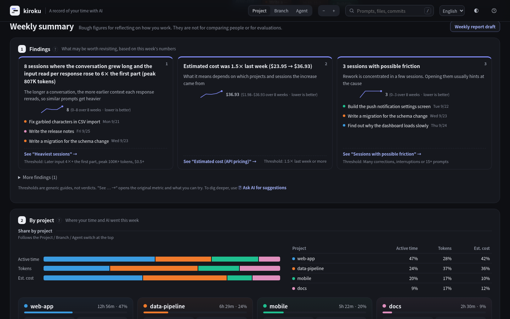

# kiroku ガイド

[English](guide.en.md) | 日本語

README（[日本語](../README.ja.md)・[English](../README.md)）の補足です。インストールとコマンドの詳細、画面の見方、指標の定義、読み取る履歴、オプションをまとめています。

## インストール

### macOS・Linux（推奨）

```bash
curl -fsSL https://raw.githubusercontent.com/MichinaoShimizu/kiroku/main/install.sh | sh
```

OS と CPU（Intel / Apple Silicon・ARM）に合ったファイルを [Releases](https://github.com/MichinaoShimizu/kiroku/releases) からダウンロードし、`checksums.txt` で検証してから `/usr/local/bin`（書き込めない場合は `~/.local/bin`）に配置します。環境変数でバージョンと配置先を指定できます。

```bash
curl -fsSL https://raw.githubusercontent.com/MichinaoShimizu/kiroku/main/install.sh | KIROKU_VERSION=v0.1.1 KIROKU_INSTALL_DIR=~/bin sh
```

### Windows

[Releases](https://github.com/MichinaoShimizu/kiroku/releases) から `kiroku_<バージョン>_windows_<amd64 または arm64>.zip` をダウンロードして展開します。

### Go

```bash
go install github.com/MichinaoShimizu/kiroku@latest
```

> macOS でブラウザからダウンロードした `kiroku` を開くと、「“kiroku”は開いていません」と表示されることがあります（Apple の公証を受けていないため）。`install.sh` と `go install` ではこの警告は出ません。ブラウザからダウンロードした場合は `xattr -d com.apple.quarantine ./kiroku` を実行するか、システム設定 → プライバシーとセキュリティ の「このまま開く」から開いてください。

## コマンド

| コマンド | 説明 |
|---|---|
| `kiroku serve [待ち受けアドレス]` | `http://localhost:8484/` で画面を表示し続けます。数秒ごとに履歴フォルダの変化（ファイル名・サイズ・更新日時のみ）を確認し、書き込みが落ち着いてから読み直します（変化が 10 秒止まったら。エージェントが書き込み続けていても、最長 60 秒で読み直します）。表示中の週・月や選択中のセッションはそのままで新しい履歴が反映され、左上に `LIVE` と表示されます。`kiroku serve :8485` のようにポートを変更できます。Ctrl+C で終了します |
| `kiroku html [-o ファイル]` | 実行時点までの履歴をすべて読み取り、1 つの HTML ファイルに出力します。持ち運ぶときや、サーバーを起動せずに見たいときに使います。その後の履歴を反映するには再実行してください |
| `kiroku json [-o ファイル]` | 集計結果を JSON で出力します（`-o -` で標準出力） |
| `kiroku version` | バージョンを表示します |
| `kiroku update` | GitHub Releases から同じ OS・CPU 向けの最新版をダウンロードし、`checksums.txt` で検証してから自身を置き換えます。書き込み権限のない場所（`/usr/local/bin` など）では `sudo kiroku update` を実行してください。`go install` やソースからビルドした kiroku（バージョンが `dev`）は置き換えないため、`go install …@latest` で更新してください。v0.1.1 以前には `update` がないため、一度だけ `install.sh` か Releases から再インストールしてください |

旧形式の `kiroku --serve`・`--json`・`-o` も当面は使えます。`--weekly` / `--monthly`（Markdown 出力）は廃止しました。週次・月次サマリーは画面で確認してください。

## 画面

- 縦型の週カレンダーに、セッションを帯で表示します。発言が多いほど濃く表示し、時間が重なるセッションは横に並べます
- 右上の「週 / 月」で表示を切り替えます。月カレンダーでは、日ごとの作業時間を色の濃さで、プロジェクトの内訳を細い帯で表示します。日付をクリックすると、その週の週カレンダーに移動します
- カレンダーの上に、その週・月の要点（作業していた時間・作業した日・セッション / 依頼・トークン・目安コスト・Kiro クレジット・コミット（うち AI））を表示します。記録のない項目は出しません
- 日ごとのトークン・目安コスト・クレジットを、週カレンダーの曜日見出しと月カレンダーの各日に表示します。サマリーの「日ごとの使用量」では、3 つを切り替えて棒グラフで確認できます
- 色分けはプロジェクト / ブランチ / ツール（エージェント）から選べます（幅の狭い画面では凡例の左の選択欄から）。凡例の数はセッション数で、クリックすると表示・非表示を切り替えます
- 帯をクリックすると、詳細を表示します（時刻つきの依頼の流れ、使用したモデル、サブエージェント、使用したツール、変更したファイル、再開コマンド）。広い画面では、左に数値と依頼の流れ（何をしたか）、右にコミット・PR・変更したファイル（何が残ったか）を並べます。「このセッションを AI と振り返る」を押すと、依頼の流れと数値から、依頼の仕方や作業の分け方の改善点を AI に聞くためのプロンプトをコピーします（依頼文を含むので、送る前に確認してください）
- 週カレンダーで、コミットのある日は右端にコミットの印を時刻の位置に並べます（セッションの帯とは重ねません。触れると短いハッシュを表示します。日付の下の数と同じく、表示中の時刻で日を区切ります）。印をクリックすると、コミットの詳細を表示します（件名・本文・プロジェクト・ブランチ・ハッシュ、変更したファイルごとの追加・削除の行数、そのコミットを作ったセッション、`git show` のコマンド）。セッションの詳細には、そのセッションの間のコミットを並べます
- リンクにできるものはリンクにしています
  - git のコミット・変更したファイル：リモート（`origin`）が GitHub・GitLab・Bitbucket などなら、そのコミットとファイルのページを開きます
  - セッションの「変更したファイル」：そのセッションの間のコミットで変わったファイルなら、そのコミットでのファイルのページを開きます
  - セッションの「作った PR」：AI が作った PR（`gh pr create` や GitHub のツールの結果に出た URL）を開きます
  - セッションの「履歴ファイル」：そのセッションの元の履歴を開きます。`kiroku serve` では画面から（読み込んだセッションの履歴ファイルだけを、手元の画面にだけ返します）、`kiroku html` では `file://` で開きます。SQLite の履歴は開けないので、パスのコピーだけです
- カレンダーの下に、週次・月次サマリーを表示します。いちばん上の ① 気づき では、基準を超えた指標を「見えたこと・なぜ気にするか・該当するセッション・基準」の形で優先度の高い順に 3 件まで示します。「〜を見る」を押すと元の指標へ移動し、説明を開きます。各カードには、その指標の 8 週（月表示では 8 か月）の推移を表示します。試したことが効いたかは、次の期間以降にこの推移で確かめます。② プロジェクト別では、いちばん上に、作業時間・トークン・目安コスト・クレジットのそれぞれを何割どこに使ったかを、横に並んだ帯と表で示します（上位 5 つ＋その他）。くくりは上の「プロジェクト・ブランチ・エージェント」の切り替えに合わせて変わります。指標どうしを見比べると「時間の割に目安コストが多い」プロジェクトやブランチ、エージェントがわかります。その下のカードでは、プロジェクトごとに「どのセッションに何時間、どれだけのトークン・目安コスト・クレジットを、どのモデルを中心に使い、どれが最も重かったか」と成果の印を示します。③ コストと成果では、使ったもの（作業時間・目安コスト・トークン・クレジット）と残ったもの（コミット・PR・変更した行など）を並べます。続いて ④ 時間の使い方 ⑤ AI の使い方 ⑥ 週 / 月のかたち、最後に ⑦ AI に改善案を聞く が表示されます。④ 時間の使い方では、推定を含む指標（言い直し・中断、切り替え、並列、待たせ時間）を「詳しい指標」に折りたたんでいます
- 各指標の「?」を押すと、定義と、そこから言えること・言えないこと・打てる手を表示します
- 「AI に改善案を聞く」には、表示中の週・月の集計をもとに、使い方の改善案を AI に聞くためのプロンプトを表示します。「プロンプトをコピー」でコピーし、お使いの AI エージェントに貼り付けて使います（kiroku 自身は AI を呼び出しません）。セッション名（依頼文の一部）とプロジェクト名を含むため、送る前に内容を確認してください
- 検索（右上、`/`）：依頼文・タイトル・プロジェクト・ブランチに加えて、変更したファイル・PR・そのセッションの間のコミット（件名・ハッシュ・ファイル）も探します。カレンダーは一致したセッションだけを表示し、サマリーの位置に全期間の検索結果（どこに一致したかの抜粋つき）を表示します。結果を押すと、その週を開いて詳細を表示します
- 週報・月報の下書き：サマリーの見出しの「週報の下書き」を押すと、プロジェクトごとに、やったこと（セッション名）・コミット・PR をまとめた Markdown の文面が開きます。文面を確かめてから「コピー」でコピーします。セッション名は依頼文の冒頭なので、共有する前に確認・編集してください
- 詳細を開くとフォーカスが詳細の中に移り、閉じると開いた帯やカードに戻ります。詳細の中で別の詳細（コミットやセッション）へ移ったときは「前の詳細に戻る」で戻れます
- キーボード操作：`←` `→` で週・月を移動、`T` で今週・今月、`W` `M` で週・月を切り替え、`/` で検索、`+` `−` でズーム、`Esc` で詳細を閉じる、`?` で一覧を表示
- 画面の言語は、ブラウザの言語に合わせて日本語か英語になります（日本語のブラウザでは日本語）。右上の選択欄で切り替えられ、選んだ言語はブラウザに保存されます。README とこのガイドの画像は英語表示です
- テーマは自動・ライト・ダークから選べます（右上のボタン）。色分け・ズーム・テーマの設定はブラウザに保存されます
- スマートフォンの画面幅では、週カレンダーを横にスクロールでき（開いたときは、今日までで最後に作業した日とその前の日を表示します）、サマリーは 1 列で表示します
- 色は Okabe–Ito の配色をもとにした 8 色で、色覚の違いがあっても区別しやすくしています。9 色目以降は灰色で表示します

## 週次・月次サマリー



画像は英語表示です。日本語のブラウザでは日本語で表示されます（右上の選択欄で切り替えられます）。

| 指標 | 定義 |
|---|---|
| 気づき | 次の基準を超えた指標を、優先度の高い順に表示します。利用上限に 1 回以上当たった／長くなった会話がある（後半の入力が前半の 4 倍以上・最大 10 万トークン以上・$0.5 以上）／軽い作業での高いモデルの合計が、目安コスト（$2 以上）の 10% 以上かつ $1 以上／目安コスト $1 以上でコミットも PR もない Claude Code のセッションが、期間の目安コスト（$2 以上）の 40% 以上／目安コストが前の期間の 1.5 倍以上／1 コミットあたりの目安コストが前の期間の 1.5 倍以上（コミット 3 回以上）／言い直し・中断のあった依頼が 20% 以上（依頼 10 件以上）、またはこじれたかもしれないセッションがある／キャッシュから読んだ割合が 50% 未満（トークン 1M 以上）／コミットまで行ったセッションが 25% 未満（セッション 5 件以上）／1 日の切り替えが平均 5 回以上／作業 4 時間以上で集中ブロックが 0 回／待たせ時間の 90 パーセンタイルが 15 分以上（n≥10）／深夜が 2 時間以上かつ作業の 25% 以上 |
| プロジェクト別 | プロジェクトごとの作業時間と割合、セッション / 依頼の数、トークン・目安コスト・クレジット、中心のモデル（トークンの割合。トークンを記録しないエージェントは回数）、稼働時間の長いセッション上位 3 件、最も重いセッション（目安コスト、なければクレジット、なければトークンで判定）。複数のプロジェクトが同時に稼働していた時間は按分します |
| 作業していた時間 | いずれかのセッションが稼働していた時間（重なりは 1 回として計算） |
| AI の延べ稼働 | 並列で稼働した分も合算した時間 |
| 集中ブロック | 5 分以内の中断を挟みつつ 60 分以上続いた作業と、その中で最も多かったプロジェクト |
| 1 日の切り替え | 連続する依頼の間でプロジェクトが変わった回数 |
| 並列で動かした時間 | 2 つ以上のセッションが同時に稼働していた時間と、最大の同時稼働数 |
| 待たせ時間 | AI の応答から次の依頼までの時間（30 分以内のもの）の中央値と 90 パーセンタイル |
| 深夜・週末 | 22〜6 時と土日の作業時間 |
| 言い直し・中断のあった依頼 | 依頼文の表現（「違う」「やり直して」など）と中断から推定した割合。依頼の数（n）を併記します |
| 長くなった会話 | 1 回の応答で読んだ入力（新しい入力とキャッシュの読み書き）が、会話の後半 4 分の 1 で前半 4 分の 1 の 4 倍以上になり、最大 10 万トークン以上になったセッション（目安コスト $0.5 以上。応答が 8 回以上あり、トークンを記録するエージェントのみ） |
| 軽い作業での高いモデル | 主に Opus 系のモデルを使い、依頼 3 件以下でファイルを編集しなかった、目安コスト $0.3 以上のセッションの合計 |
| 利用上限に当たった回数 | Claude Code の履歴に残った、利用上限（使用量の上限・レート制限）のエラーの回数と時刻。1 分以内に続いたものは 1 回と数えます。カレンダーには赤い「上限」の印で表示します |
| こじれたかもしれないセッション | 言い直し・中断・15 回以上の依頼が多いセッション |
| 日ごと・週ごとのリズム | 週表示では日ごと、月表示では週ごとの作業時間（うち深夜） |

### AI の使い方

| 指標 | 定義 |
|---|---|
| 目安コスト（API 換算） | API の公開料金で換算した使用料。Claude Code が自身の使用料（`cost-state`）を記録しているセッションはその値を使います（料金の改定・新しいモデル・自動要約など履歴に残らない呼び出しも含む）。ないときは履歴のトークン数に kiroku の料金表を掛けます。サブスクリプションの請求額とは異なります |
| トークン | 入力・出力・キャッシュ読み取り・キャッシュ書き込みの合計。1 つの応答が複数行に分けて記録されるため、メッセージ ID ごとにまとめてから数えます |
| キャッシュから読んだ割合 | 入力のうちキャッシュから読み取った割合 |
| モデル別 | モデルごとの目安コストとトークン |
| サブエージェント | `Task` / `Agent` での呼び出し回数、種類、延べ時間。セッションの詳細では、いつ・どの種類に・何を依頼し・どれだけ時間がかかったかを表示します |
| Kiro クレジット | Kiro の履歴に記録された実際のクレジット |
| 日ごとの使用量 | 日ごとのトークン・目安コスト・クレジット。記録された時刻の日に計上します |
| 1 依頼あたりの目安コスト | 目安コスト ÷ 依頼の数 |
| 重かったセッション | 目安コストの大きいセッション上位 3 件 |

料金表は、Claude Code が使用料を記録していないセッション（古い版の Claude Code など）に使います。料金表には 2026 年 10 月時点の[公開料金](https://platform.claude.com/docs/en/about-claude/pricing)を収録しています。料金の改定や未収録のモデルには、JSON で上書きして対応できます（モデル ID の前方一致、単位は USD / 100 万トークン）。

```json
{"claude-opus-5-5": {"input": 4, "output": 20, "cache_write": 5, "cache_write_1h": 8, "cache_read": 0.2}}
```

```bash
kiroku serve --prices my-prices.json
```

### 成果の印

時間やトークンなどのコストと並べて、使い方が形に残る作業につながったかを確かめるための、成果の代理の数値です。

- **Git のコミット**は、エージェントが作業したリポジトリ（セッションの作業場所）を手元の `git` で読み、自分（`git config user.email`）のコミットを数えます。手で行ったコミットも含みます。エージェントがツールで実行したコミットと時刻（前後 2 分）が一致したものは「AI が実行」として数えます。カレンダーにはコミットの印と短いハッシュのバッジで表示します（塗りつぶしは AI が実行したもの）。`git` コマンドがない環境では読みません
- それ以外は、AI がツールで実行し、成功したものだけを数えます（現在は Claude Code のみ）

| 指標 | 定義 |
|---|---|
| Git のコミット | 手元のリポジトリにある自分のコミット（マージコミットを除く）。そのリポジトリで最初のセッションの前日から読みます |
| コミット | AI が実行して成功した `git commit` の回数（`--dry-run` を除く）。手で行ったコミットは含みません |
| PR の作成 | AI が作成した Pull Request の数（`gh pr create` と、名前が `create_pull_request` で終わるツール） |
| AI が編集した行（推定） | AI が編集・作成したファイルの、編集前後を比べた追加・削除の行数（目安）。`Edit`・`MultiEdit`・`Write` から数えます |
| コミットまで行ったセッション | 期間中にコミットか PR 作成まで行ったセッションの数と割合 |
| 1 コミットあたりの目安コスト | 目安コスト ÷ コミットの回数 |

### エージェント別の参考指標

各エージェントが履歴に記録している数値を、エージェントごとに表示します（週次・月次サマリーとセッションの詳細）。定義がエージェントごとに異なるため、**エージェント同士で比較しないでください**。いずれも参考値であり、目標値ではありません。記録のない数値は 0 とせず、表示しません。

| エージェント | 参考指標 |
|---|---|
| Claude Code | 応答数、1 応答あたりの出力トークン、入力のうちキャッシュから読んだ割合、ツール呼び出し、サブエージェントの実行 |
| Kiro CLI | クレジット、ターン、1 ターンあたりのクレジット、モデルへのリクエスト、組み込みツールの実行 |
| Kiro IDE | クレジット、ターン、1 ターンあたりのクレジット、ツール呼び出し |
| Kiro Crew | Crew から実行した会話（うちサブエージェント）、クレジット、ターン |
| Kiro CLI（SQLite）・Amazon Q | 最初の応答までの時間（中央値）、応答時間（中央値）、応答の長さ（平均）、ツール呼び出し |
| Codex | 応答数、推論トークン、出力のうち推論の割合、入力のうちキャッシュから読んだ割合、コンテキストの最大使用率、レート制限の最大使用率、ツール呼び出し |

時刻は PC のタイムゾーンで計算します。数値はすべて履歴から推定した目安です。データがない場合は 0 ではなく「不明」と表示します。トークン・目安コスト・AI の延べ稼働は使用量の目安であり、生産性や削減できた時間を示すものではありません。

> 自分の使い方を振り返るための数値です。他人との比較や評価には使わないでください。

### 指標の読み方

画面の各指標の「?」を押すと、同じ説明を表示します。改善案プロンプトにも前提として含めています。1 つの数値だけで判断せず、自分の過去の期間と比べて読んでください。

| 指標 | 言えること | 言えないこと | 打てる手 |
|---|---|---|---|
| 気づき | どの指標から見直すとよさそうか | 良し悪しの判定。基準は一律の目安で、使い方によっては当てはまらない | 1 つ選んで次の期間に試し、同じ指標で変化を確かめる |
| プロジェクト別 | 時間と AI をどのプロジェクトに配分したか | プロジェクトの重要度や成果 | 想定と配分がずれていれば、使い方や優先順位を見直す |
| 作業していた時間 | AI と一緒に作業していた時間の総量 | 人が集中していたか。放置していた時間も含む | 前の期間との増減で、AI に頼る割合の変化をつかむ |
| AI の延べ稼働 | AI をどれだけ働かせたか。作業していた時間との差は並列の度合い | 人が削減できた時間や生産性 | 作業していた時間とほぼ同じなら、待ち時間に別の作業を並行させる余地がある |
| 集中ブロック | まとまった作業時間を確保できていたか | その時間の作業の質 | 細切れが多ければ、AI に任せる作業を時間帯でまとめる |
| 集中ブロック（一覧） | いつ・どのプロジェクトで長く作業していたか | 成果 | 集中しやすい時間帯を把握して、重い作業をそこに寄せる |
| 1 日の切り替え | プロジェクトをどれだけ行き来したか | 切り替えが悪いかどうか（待ち時間を活用しているだけの場合もある） | 多すぎる日は、文脈の切り替えで手戻りが増えていないか確認する |
| 並列で動かした時間 | 複数のセッションを並行して回せていたか | 並列にした分の成果 | 少なければ、AI の作業中に別のタスクを任せる |
| 待たせ時間 | AI の応答にどれだけ早く反応していたか | 短いほど良いとは限らない（確認せずに進めている可能性もある） | 長ければ通知を使う、確認をまとめるなど、応答待ちの扱いを決める |
| 深夜 | 時間外にどれだけ作業していたか | 働きすぎかどうかの判定 | 自分のペースの振り返りに使う |
| 週末 | 週末にどれだけ作業していたか | 働きすぎかどうかの判定 | 自分のペースの振り返りに使う |
| 言い直し・中断のあった依頼 | 最初の依頼が意図どおりに伝わらなかった割合の目安 | 推定のため誤判定がある。原因も分からない | 高ければ、依頼文に前提・制約・完了条件を書き足す |
| 長くなった会話 | 会話を続けたことで、1 回あたりの応答が重くなったセッション | 会話を続けたほうがよかったかどうか（前の文脈が必要な作業もある） | 区切りのいいところで要点をメモに残し、新しいセッションで続ける |
| 軽い作業での高いモデル | 高いモデルを使った短い作業にかかった量 | そのモデルが必要だったかどうか（難しい調査や設計の相談もある） | 調べものや相談は、まず軽いモデルで試し、足りなければ切り替える |
| 利用上限に当たった回数 | どの時間帯・どの作業で上限に当たり、作業が止まったか | 上限までの残り。ほかのエージェントや、ブラウザ・アプリでの利用分 | 重い作業を時間帯で分ける、軽いモデルに振り分ける、長い会話は区切って新しく始める |
| こじれたかもしれないセッション | 手戻りが集中したセッション | こじれた原因 | 中身を開いて、依頼の仕方や作業の分け方を見直す |
| プロジェクトの配分 | 時間の配分 | 配分の妥当さ | 想定と違えば、優先順位を見直す |
| 日ごと・週ごとのリズム | 作業量の波と偏り | 波の原因 | 特定の日に偏っていれば、作業の割り振りを見直す |
| 日ごとの使用量 | どの日に AI を多く使ったか | その日の使い方が適切だったか | 突出した日のセッションを開いて、重かった理由を確認する |
| 目安コスト（API 換算） | 使用量の重さを金額で比べた目安 | 実際の請求額（サブスクリプションとは異なる） | 重いセッションやモデルを特定して、使い方を見直す |
| トークン | 消費した量 | 多い・少ないの良し悪し | プロジェクト別・日別の偏りを見る |
| キャッシュから読んだ割合 | 同じ文脈を再利用できていたか | 低い原因（短いセッションが多いだけの場合もある） | 低ければ、長い前提を毎回貼り直していないか確認する |
| モデル別 | どのモデルに使用量が寄っていたか | そのモデルが必要だったか | 定型的な作業を軽いモデルに回せないか検討する |
| サブエージェント | 調査などを切り出して任せていたか | 任せた効果 | 本体の文脈を節約する手段として使えているか確認する |
| Kiro クレジット | 実際に消費したクレジット | アカウントページとの差（集計期間や他の PC での利用分） | 上限に対する消費ペースを管理する |
| 1 依頼あたりの目安コスト | 1 回の依頼の平均的な重さ | 依頼の大きさの違い | 推移を見て、依頼の粒度の変化をつかむ |
| 重かったセッション | 使用量を押し上げたセッション | 重さに見合う成果があったか | 中身を開いて、文脈の膨らみや手戻りがなかったか確認する |
| 成果の印 | 使ったコストが、形に残る作業につながったか | 成果の価値や品質。手で行ったコミットは含まない | コストと並べて、形にならなかった使い方がないか見直す |
| Git のコミット | AI と作業した時間が、どれだけ記録に残る変更になったか | 変更の価値。リポジトリの外の作業や、ほかの人のコミット | 作業時間やコストが多いのにコミットが少ない日は、何に時間を使ったかを確認する |
| コミット | 作業が区切りまで進んだ回数の目安 | 変更の価値や大きさ。コミットの粒度は人や作業で異なる | コストに対してコミットが少ない期間は、何に時間を使ったかを確認する |
| PR の作成 | レビューに出せる単位まで仕上がった回数 | マージされたか、価値があったか | 作成までの手戻りが多ければ、依頼の単位を小さくする |
| AI が編集した行（推定） | AI が手を入れた量 | 価値や品質（生成コードや整形で大きく増える） | 量そのものを目標にせず、コストとの釣り合いの確認に使う |
| コミットまで行ったセッション | 使ったセッションのうち、形に残った割合 | 調査や相談など、コミットを目的としないセッションの価値 | 割合が低ければ、途中で止まったセッションの理由を確かめる |
| 1 コミットあたりの目安コスト | 区切りまで進めるのにかかった重さの目安 | コミットの大きさの違い。手で行ったコミットは含まない | 推移を見て、同じ作業を軽く進められているかを確かめる |
| エージェント別の参考指標 | 同じエージェント内での傾向 | エージェント同士の比較（定義が異なる） | 同じエージェントの期間ごとの変化だけを見る |

## 読み取る履歴

| エージェント | 場所 | 時刻の粒度 |
|---|---|---|
| Claude Code | `~/.claude/projects/*/*.jsonl` | 発言ごと |
| Kiro IDE（v1.0 以降） | `~/.kiro/sessions/<hash>/sess_*/` | 発言ごと |
| Kiro CLI | `~/.kiro/sessions/cli/` | 依頼ごと |
| Kiro IDE（v1.0 より前） | `<globalStorage>/kiro.kiroagent/workspace-sessions/` | 開始と最終更新のみ |
| Kiro Crew | `~/.kiro/crew/`（`session_map.json`・`usage/tokens/`） | 依頼・ターンごと |
| Kiro CLI（旧バージョン） | `kiro-cli/data.sqlite3`（下表） | 依頼ごと |
| Amazon Q Developer CLI | `amazon-q/data.sqlite3`（下表） | 依頼ごと |
| Codex CLI | `~/.codex/sessions/YYYY/MM/DD/rollout-*.jsonl`（`.jsonl.zst` を含む）と `archived_sessions/` | 発言ごと |
| Git（自分のコミット） | セッションの作業場所にあるリポジトリ（手元の `git log`） | コミットごと |

`data.sqlite3` の場所:

| OS | 場所 |
|---|---|
| macOS | `~/Library/Application Support/<kiro-cli または amazon-q>/` |
| Linux | `$XDG_DATA_HOME`（未設定なら `~/.local/share`）`/<kiro-cli または amazon-q>/` |
| Windows | `%LOCALAPPDATA%\<kiro-cli または amazon-q>\`（Kiro CLI は未確認。異なる場合は `--kiro-cli-db` で指定してください） |

- `KIRO_HOME`・`KIROCREW_HOME`・`CODEX_HOME`・`CLAUDE_CONFIG_DIR` が設定されている場合は、その場所を読み取ります
- 同じ会話が 2 か所に記録されていても、1 回だけ数えます。除外した件数は画面の「計測の状態」に表示します
- Kiro のクレジットは、履歴に記録された値をそのまま合計します（モデルごとの倍率は掛け直しません）。Kiro IDE（v1.0 より前）と Kiro CLI（SQLite）の履歴にはクレジットが記録されていないため、その分は含まれません。単位は表記の揺れ（`credit`・`Credits` など）を区別しません。アカウントページの数値とは、集計期間（請求期間）、他の PC での利用分、Kiro が削除した古い履歴、チャット以外での利用（エージェントフックなど、履歴に残らないもの）により差が出ることがあります
- Codex のモデル（OpenAI）は料金表に収録していないため、目安コストに含まれません。含めたい場合は `--prices` で追加できます

各履歴の読み取り方と重複の除外方法は [sources.md](sources.md) にまとめています。読み取れない履歴があれば issue で知らせてください。

### 履歴の保存期間

エージェントによっては、古い履歴を自動で消します。消えた履歴は kiroku でも見られなくなり、元に戻せません。過去の分を振り返りたい場合は、早めに設定してください。画面の「計測の状態」には、エージェントごとの最も古い記録の日付を表示し、既定のまま消える設定のときは、サマリーの上でお知らせします（公式ドキュメントへのリンク付き）。

| エージェント | 自動で消すか | 設定 |
|---|---|---|
| Claude Code | **消す**。既定では 30 日より古い会話の記録を、起動後に通知なしで消します | `~/.claude/settings.json` の [`cleanupPeriodDays`](https://code.claude.com/docs/en/settings-reference#cleanupperioddays)（日数。最小 1。`0` はエラーになるため、長く残すには `3650` のような大きな値にします） |
| Kiro Crew | **消す**。会話の記録（`sessions/archive/`）を一定期間で消します。期間は Crew の版や設定によります | Crew の [`session.archive_retention_days`](https://kiro.dev/docs/crew/configuration/) |
| Kiro IDE・Kiro CLI・Amazon Q・Codex | 公式ドキュメントに、期間で自動的に消すという記載はありません（手動で消す機能はあります） | — |

Claude Code の設定の例:

```json
{
  "cleanupPeriodDays": 3650
}
```

kiroku が読むのは利用者の設定（`~/.claude/settings.json`、`CLAUDE_CONFIG_DIR` があればその下）だけです。プロジェクトや組織の設定で指定している場合は、お知らせが出ても実際の期間とは異なることがあります。

## オプション

履歴を読み取るコマンド（`serve`・`html`・`json`）に共通:

| オプション | 既定値 | 説明 |
|---|---|---|
| `--sources` | `claude,kiro,amazonq,codex` | 読み取る履歴（カンマ区切り。Kiro Crew は `kiro` に含まれます） |
| `--root` | `~/.claude/projects` | Claude Code の履歴の場所（`CLAUDE_CONFIG_DIR` も参照） |
| `--kiro-home` | `~/.kiro` | Kiro のデータの場所（`KIRO_HOME` も参照） |
| `--crew-home` | `~/.kiro/crew` | Kiro Crew のデータの場所（`KIROCREW_HOME` も参照） |
| `--kiro-cli-db` | OS ごと | Kiro CLI（旧バージョン）の `data.sqlite3` |
| `--amazonq-db` | OS ごと | Amazon Q Developer CLI の `data.sqlite3` |
| `--codex-home` | `~/.codex` | Codex のデータの場所（`CODEX_HOME` も参照） |
| `--gap` | `15` | セッションの帯を分ける空き時間（分） |
| `--prices` | | 料金表を JSON で上書き（「AI の使い方」参照） |

コマンドごと:

| コマンド | オプション | 既定値 | 説明 |
|---|---|---|---|
| `serve` | `[待ち受けアドレス]` | `127.0.0.1:8484` | `:8485` のようにポートのみの指定も可 |
| `serve` | `--interval` | `5s` | 履歴の変化を確認する間隔。変化が間隔の 2 倍止まったら読み直します（長くても 12 倍） |
| `serve`・`html` | `--no-open` | | ブラウザを開かない |
| `html` | `-o`, `--out` | `kiroku.html` | 出力する HTML ファイル |
| `json` | `-o`, `--out` | `kiroku.json` | 出力する JSON ファイル（`-` で標準出力） |
| `update` | `--check` / `--to <バージョン>` / `--force` | | 確認のみ / バージョンを指定 / dev 版や同じバージョンでも置き換える |

## 注意

- 出力した HTML と JSON には、依頼文やファイルパス、コミットメッセージがそのまま含まれます。人に渡すときは内容を確認してください（このリポジトリの `.gitignore` では `*.html` と `kiroku.json` を除外しています）
- `kiroku serve` は既定で自分の PC からのみアクセスできます（`127.0.0.1` で待ち受け、他のホスト名宛てのリクエストは拒否します）。`kiroku serve 0.0.0.0:8484` のように外部に公開すると、同じネットワーク上の人も履歴を閲覧できます
